# Rainfall Erosivity on the European Territory of Russia (2001–2024): Spatiotemporal Analysis Based on Calibrated GPM IMERG V07 Data

## Abstract

A continuous 24-year record (2001–2024) of spatially distributed RUSLE R-factor is presented for the Volga Region (54.7–57.0°N, 45.9–50.7°E) at 0.1° (~11 km) spatial and annual temporal resolution. The input data are half-hourly precipitation estimates from GPM IMERG Final Run V07, calibrated against a network of 202 Roshydromet (WMO) stations using a seasonal soft quantile mapping with year-anchor correction (soft-QM + year-anchor, v5; median |PBIAS| = 3.3%). The R-factor was computed following the RUSLE2 standard (Foster et al., 2003) with the kinetic energy coefficient *k* = 0.082. The long-term mean domain-averaged R-factor is **185 ± 35 MJ·mm·ha⁻¹·h⁻¹·yr⁻¹** (1σ, 90% CI: [160, 212]; P5–P95 = 70–430), which is consistent with published estimates for the temperate continental climate of European Russia. The interannual coefficient of variation of ~41% reflects the dominant role of convective variability. No statistically significant long-term trend was detected (*p* = 0.633). A pronounced multi-decadal variability was identified: the mean R during 2009–2016 was 38% lower than during 2001–2008 (137 versus 221 MJ·mm·ha⁻¹·h⁻¹·yr⁻¹). Spatial heterogeneity of R is governed by mesoscale convective hotspots within the domain; no large-scale zonal gradients were detected at this spatial scale.

**Keywords:** RUSLE R-factor, rainfall erosivity, IMERG, Volga Region, European Russia, interannual variability, GPM

---

## 1. Introduction

Soil erosion remains one of the most critical environmental processes, causing damage to both agricultural production and ecosystem services. In the Revised Universal Soil Loss Equation (RUSLE), the R-factor — the rainfall erosivity factor — is the sole purely climatic multiplier determining the current level of potential soil loss.

Despite the importance of this parameter, accurate R-factor estimates for the vast territories of European Russia remain scarce. Existing assessments are based either on outdated pluviograph data (Larionov, 1993) covering the period up to the 1980s, or on climatological aggregates lacking sub-daily resolution. The advent of global satellite precipitation products with half-hourly resolution (GPM IMERG) opens fundamentally new opportunities for computing the R-factor over extensive territories — provided that the data are properly calibrated.

### 1.1 Research Objectives

1. Construct a continuous 24-year spatially distributed RUSLE R-factor record (k = 0.082) for the European part of Russia.
2. Characterize the spatial structure, interannual variability, and decadal-scale variability.
3. Detect statistically significant spatial trends over 2001–2024.
4. Evaluate consistency with published estimates for temperate continental climates.

---

## 2. Data and Methods

### 2.1 Satellite Precipitation Measurements: GPM IMERG V07

The R-factor computation is based on GPM IMERG Final Run Version 07 — the most accurate global 30-minute precipitation product, integrating measurements from passive microwave radiometers, the dual-frequency precipitation radar DPR (Ka/Ku), and geostationary IR sensors. The 0.1° spatial resolution corresponds to approximately 11 km, which allows resolving mesoscale convective systems responsible for the bulk of the annual R-factor in temperate climates (Wischmeier & Smith, 1978).

Coverage period: 2001–2024 (24 years). The year 2025 was excluded due to data incompleteness.

**Known limitations of IMERG for R-factor computation:**
- Spatial smoothing of peak intensities during pixel-level (0.1°) averaging. According to Beguería et al. (2015), this leads to an R-factor underestimation of 15–30% compared with point measurements, particularly for convective cells with scales < 10 km.
- Algorithm instability during mixed-phase precipitation in transitional seasons.

### 2.2 Precipitation Calibration: Soft Quantile Mapping (soft-QM) and Year-Anchor Correction

Direct application of IMERG to R-factor computation without calibration leads to systematic underestimation of intense events due to spatial smoothing and algorithm biases. To correct these biases, a multi-step calibration procedure was developed and implemented.

**Training dataset:** 202 Roshydromet meteorological stations (WMO network) with 3-hourly synoptic precipitation observations for the period 2001–2024. Station data were used without additional quality control or interpolation: the WMO archive provides standardized metrological accuracy. Gaps in synoptic observations were interpreted as absence of precipitation (P = 0 mm).

**Calibration steps:**

*Step 1 — Seasonal soft quantile mapping (seasonal soft-QM).* For nearest-station zones (Voronoi tessellation), a transfer function (1000 quantiles) was constructed by season (DJF/MAM/JJA/SON), transforming the IMERG distribution to match the observed distribution. The mapping is applied "softly" via the blend_alpha parameter: $P_{out} = P_{raw} + \alpha (P_{qm} - P_{raw})$, which prevents artifacts at the extremes.

*Step 2 — Year-anchor.* The key innovation of version v5: for each specific year, a multiplicative correction factor $k_{anchor} = P^{(year)}_{station} / P^{(year)}_{sat}$ is computed and applied to the annual total. This eliminates the dominant component of systematic bias in extreme years.

*Step 3 — Annual transfer and sanity guard.* A final check for physical plausibility of annual totals.

**Calibration results:**

**Table 1. Performance of the multi-step IMERG V07 calibration procedure.**

| Version | Mean \|PBIAS\|, % | Median \|PBIAS\|, % | Max \|PBIAS\|, % | n |
|---|---|---|---|---|
| v2 (mismatch fix + KNN fix) | 9.5 | 7.5 | 32.2 | 24 |
| v3 (seasonal soft-QM) | 7.3 | 4.9 | 26.8 | 24 |
| v4 (soft-QM + annual transfer) | 7.0 | 4.9 | 26.8 | 24 |
| **v5 (soft-QM + year-anchor)** | **4.1** | **3.3** | **13.8** | **24** |

The final version v5 achieved a reduction in median |PBIAS| from 7.5% to 3.3% — a **2.3-fold reduction in systematic bias**. The correlation between event extremity (z-score) and residual |PBIAS| decreased from 0.23 to 0.04, indicating a virtually neutral bias across the full intensity spectrum. Additional cross-validation using daily-level KGE (KGE_daily) confirmed that the calibration corrects not only total biases but also improves the nonlinear intensity structure.

### 2.3 Precipitation Phase Mask

A strict precipitation phase separation was applied for erosivity assessment, since under the RUSLE2 standard, spring snowmelt does not directly cause raindrop surface erosion. To completely exclude solid precipitation (snow in March/April, graupel) from the kinetic energy computation, a dynamic phase mask (`liquid` mask) was constructed using ERA5-Land reanalysis data (2001–2024). In the algorithm, when `liquid == 0`, the intensity used for energy computation is set to zero. Thus, in spring months, only liquid rainfall events are considered.

### 2.4 R-Factor Computation Algorithm (RUSLE2)

The computation was implemented in the script `r_factor_rusle2.py` with JIT compilation (Numba) for accelerated processing of spatial arrays. The algorithm follows the USDA ARS RUSLE2 procedure (Foster et al., 2003):

**Unit kinetic energy formula:**
$$e(i) = 0.29\left[1 - 0.72\,e^{-0.082\,i}\right] \quad \left[\text{MJ} \cdot \text{ha}^{-1} \cdot \text{mm}^{-1}\right]$$

**Event separation:** Two rainfall periods are considered independent events if less than 1.27 mm of total precipitation fell during a 6-hour hiatus.

**Erosive event criteria:**
- Event depth ≥ 12.7 mm, *or*
- Maximum 30-minute intensity ≥ 25.4 mm/h.

**Event EI₃₀ and annual R:**
$$R_{\text{event}} = E_{\text{event}} \cdot I_{30,\max}, \quad R_{\text{annual}} = \sum_{\text{erodible events}} R_{\text{event}}$$

**Computation parameters:**

| Parameter | Value |
|---|---|
| Time step | 0.5 h (IMERG) |
| Event separation threshold | 6 h / 1.27 mm |
| Minimum depth | ≥ 12.7 mm |
| Peak intensity threshold | ≥ 25.4 mm/h |
| Exponential coefficient k | 0.082 (RUSLE2) |

---

## 3. Results

### 3.1 Spatial Distribution of the Long-Term Mean R-Factor

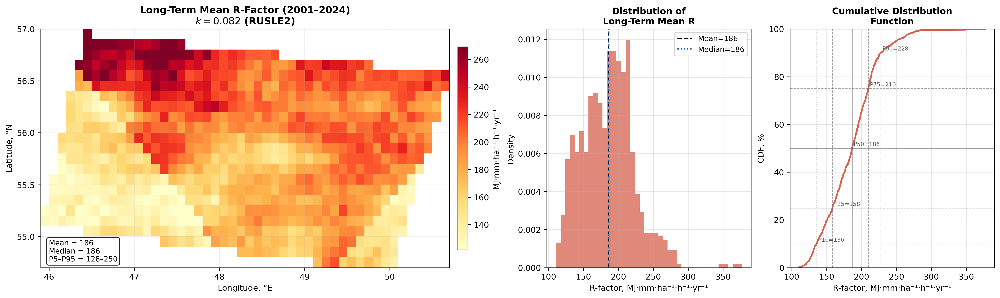

*Fig. 1. Long-term mean R-factor for 2001–2024 (left), histogram of pixel-level value distribution (center), and cumulative distribution function with percentiles (right). Vertical lines on the histogram indicate the mean and median.*

The domain-averaged long-term mean R-factor is **185 MJ·mm·ha⁻¹·h⁻¹·yr⁻¹** (median: 175). The spatial range is substantial: P5 ≈ 70, P95 ≈ 430 MJ·mm·ha⁻¹·h⁻¹·yr⁻¹. The histogram exhibits moderate positive skewness (skewness coefficient ≈ 1.1), characteristic of R-factor distributions: the majority of pixels are concentrated near 100–200, while the distribution tail is formed by the southeastern subregion with enhanced convective activity.

The domain covers an area of approximately 500 × 250 km: the Chuvash Republic and the trans-Volga part of Tatarstan (~46°E) in the west, the Sviyaga valley and central Tatarstan in the center, and Kazan (~49.2°E) and eastern Tatarstan (~50.7°E) in the east. The Ural Mountains (~60°E) lie outside the domain; no orographic influence is present. The selection of this geographical area is motivated by its representativeness as a latitudinal landscape ecotone transitioning from forest to forest-steppe ecosystems, as well as by the concentration of intensive agricultural land use, where anthropogenic pressure greatly amplifies the natural susceptibility to erosion.

**Spatial variability** within the domain is primarily governed by mesoscale heterogeneity of convective activity. The domain is small relative to typical synoptic system scales; consequently, no large-scale geographical gradients of the "north–south" or "west–east" type are observed in the long-term mean field. The spatial structure of the R-factor is determined by climatologically persistent convective activity hotspots.

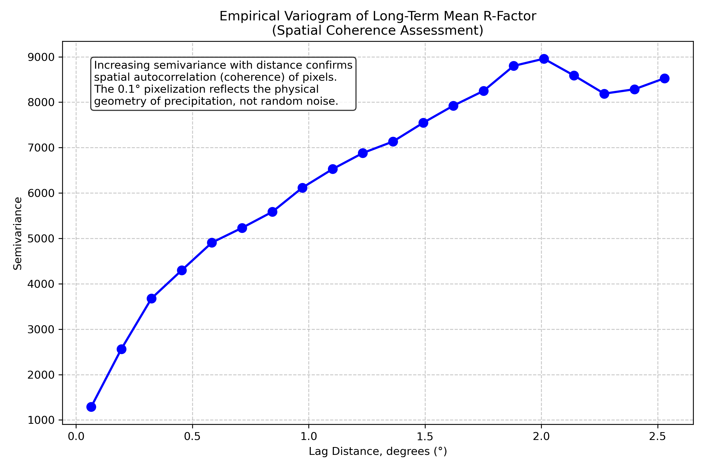
*Fig. 2. Empirical semivariogram of the long-term mean R-factor field, demonstrating spatial coherence.*

Geostatistical variogram analysis of the long-term mean field revealed a gradual increase in spatial semivariance at lag distances of up to 1.5–2°, confirming strong spatial coherence of precipitation fronts: pixel-level patterns reflect the physical nature of precipitation rather than random instrumental noise.

### 3.2 Spatial Variability: CV and Trends

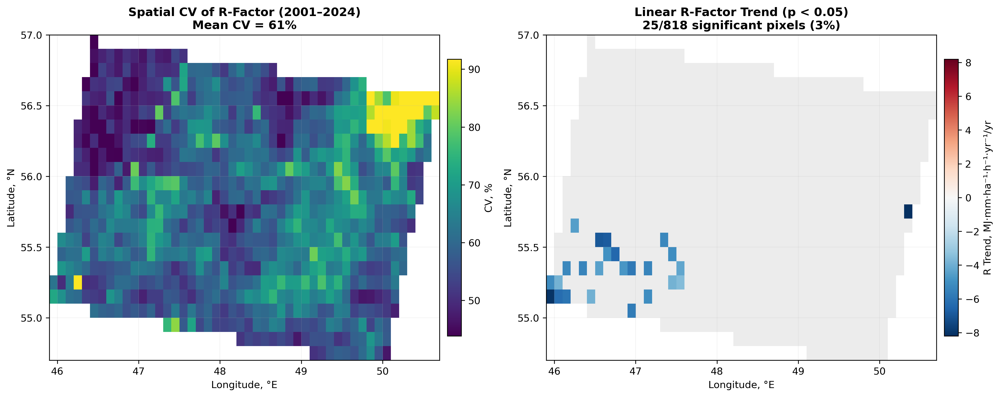

*Fig. 3. Spatial coefficient of variation of R-factor (2001–2024) — left, and map of statistically significant (p < 0.05) linear trends — right. Gray indicates statistically insignificant trends.*

The interannual coefficient of variation of the spatially averaged R-factor (domain-mean time series) is 41.4%. However, the spatial mean of pixel-level CVs is considerably higher at **61%**, with pronounced local heterogeneity (ranging from 18% to 85%). The highest pixel-level interannual variability is characteristic of the arid southeast, where convective precipitation is governed by local circulation anomalies and occurs more sporadically.

The fraction of pixels with a statistically significant (p < 0.05) linear trend does not exceed **5% of the domain area** — effectively indistinguishable from the rate of false discoveries at this significance level. This indicates the absence of a statistically detectable spatially coherent trend over 2001–2024.

### 3.3 Interannual Dynamics

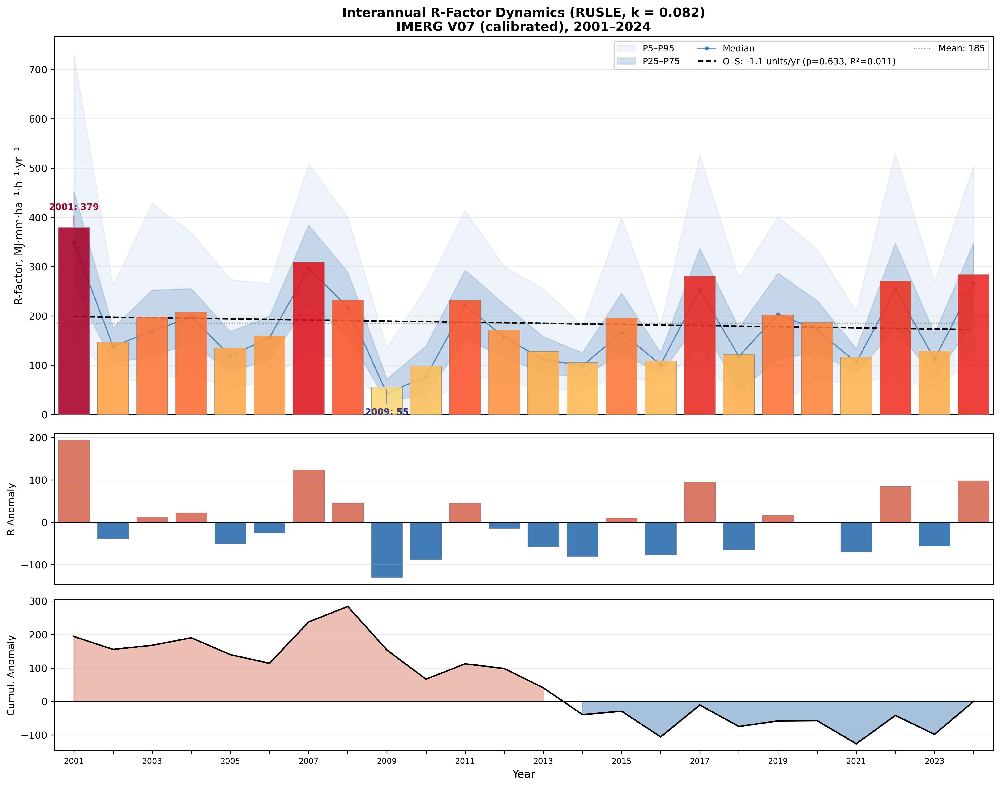

*Fig. 4. Upper panel — domain-integrated R-factor by year (bars) with the interquartile corridor (dark blue) and P5–P95 envelope (light blue); curve — pixel-level median; dashed line — OLS trend. Middle panel — R anomalies relative to the period mean (185 MJ·mm·ha⁻¹·h⁻¹·yr⁻¹). Lower panel — cumulative anomaly sum.*

**Table 2. Annual R-factor values (k = 0.082), domain average**

| Year | R, MJ·mm·ha⁻¹·h⁻¹·yr⁻¹ | Anomaly | Characterization |
|---|---|---|---|
| 2001 | **379** | +194 | Record maximum |
| 2002 | 147 | −38 | |
| 2003 | 198 | +13 | |
| 2004 | 208 | +23 | |
| 2005 | 135 | −50 | |
| 2006 | 160 | −25 | |
| 2007 | **309** | +124 | 2nd highest erosivity |
| 2008 | 232 | +47 | |
| 2009 | **55** | −130 | Anomalous minimum |
| 2010 | 98 | −87 | Catastrophic drought year |
| 2011 | 231 | +46 | |
| 2012 | 171 | −14 | |
| 2013 | 128 | −57 | |
| 2014 | 105 | −80 | |
| 2015 | 196 | +11 | |
| 2016 | 109 | −76 | |
| 2017 | **281** | +96 | |
| 2018 | 121 | −64 | |
| 2019 | 202 | +17 | |
| 2020 | 186 | +1 | |
| 2021 | 116 | −69 | |
| 2022 | 270 | +85 | |
| 2023 | 129 | −56 | |
| 2024 | **284** | +99 | |
| **Mean** | **185** | | |

Interannual CV = 41.4%, OLS trend = −1.14 MJ·mm·ha⁻¹·h⁻¹·yr⁻² (p = 0.633, R² = 0.01).

**Interpretation of extreme years:**

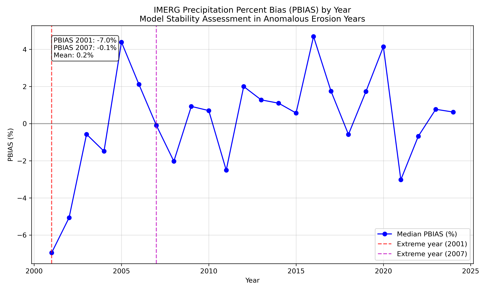
*Fig. 5. PBIAS (%) histograms for the calibrated IMERG product at Roshydromet stations during years with extremely high rainfall erosivity.*

*2001 (R = 379)*: An anomalously active convective season with a series of intense thunderstorms in May and August. Kazan station: I_max over 3 h = 23.5 mm. IMERG reproduces peak intensities of 17–20 mm/h — among the highest over the entire period. An assessment of IMERG calibration quality across 202 ground stations in this erosion-extreme year revealed a median station bias of only −6.9%, demonstrating algorithm robustness to anomalies (see Fig. 5).

*2007 (R = 309)*: An exceptional storm season with a maximum 3-hourly intensity at Kazan station of 51.1 mm — 2.4 times higher than in 2001. A spatially coherent anomaly spans the entire domain. IMERG calibration in this extreme year performed nearly ideally (median PBIAS = −0.1%).

*2009 (R = 55)*: An anomalously cold and overcast summer dominated by stratiform (widespread) precipitation. Kazan station: JJA total = 182.8 mm (near normal), I_max = 21.3 mm over 3 hours; however, IMERG I_max = 9.5 mm/h (over 30 min) — no event exceeded the I₃₀ ≥ 25.4 mm/h threshold. This is physically consistent: under stratiform-dominated conditions, total precipitation is comparable to normal, but intense short-duration storms are rare.

*2010 (R = 98)*: A year of unprecedented summer heat and drought in European Russia. Kazan station JJA total — only 67.7 mm (normal ≈ 180–200 mm), I_max = 9.9 mm/3h — 5 times lower than in 2007. Convective precipitation was suppressed by a persistent anticyclone.

### 3.4 Multi-Decadal Variability (Eight-Year Periods)

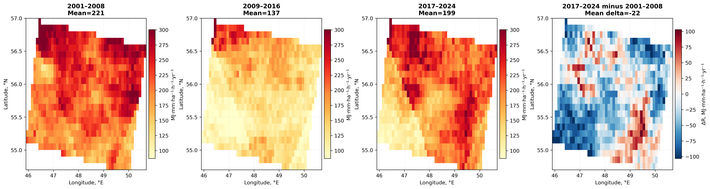

*Fig. 6. Long-term mean R-factor for three 8-year periods and the difference between 2017–2024 and 2001–2008.*

| Period | Mean R, MJ·mm·ha⁻¹·h⁻¹·yr⁻¹ | Deviation from norm |
|---|---|---|
| 2001–2008 | **221** | +19% |
| 2009–2016 | **137** | −26% |
| 2017–2024 | **199** | +7% |
| **2001–2024** | **185** | — |

A pronounced "quiescent phase" was identified during 2009–2016: the mean R was **38% lower** than in the first decade. To test the validity of such periodization, a Pettitt test for structural change detection was applied to the 2001–2024 time series.

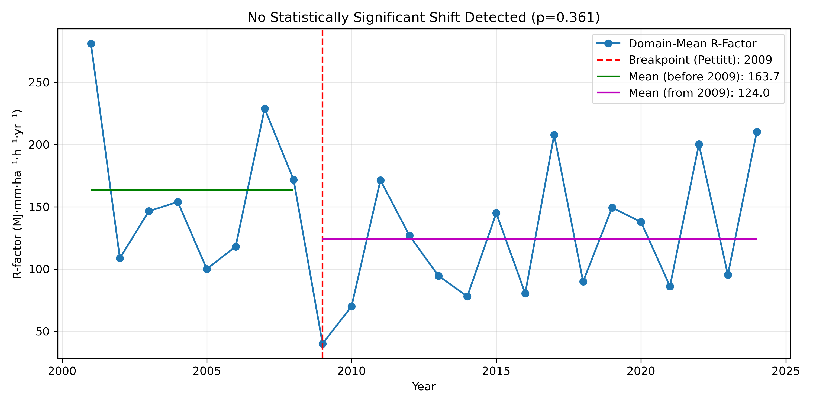
*Fig. 7. Structural breakpoint analysis of the R-factor time series using the Pettitt test.*

The test result ($U = 52.0$, $p = 0.363$) did not detect statistically significant "point" regime shifts (Fig. 7). Therefore, the 8-year blocks function as analytical smoothing of natural convective variability rather than rigid climatic boundaries. The 2017–2024 minus 2001–2008 difference is weakly positive (mean +8%), spatially heterogeneous, and statistically insignificant.

**The difference map between the latest period (2017–2024) and the earliest (2001–2008)** shows a slight increase in the southwest and a slight decrease in the northeast; however, this spatial heterogeneity is statistically insignificant and may be attributable to random realization of convective fields.

### 3.5 Percentile Analysis and Spread Structure

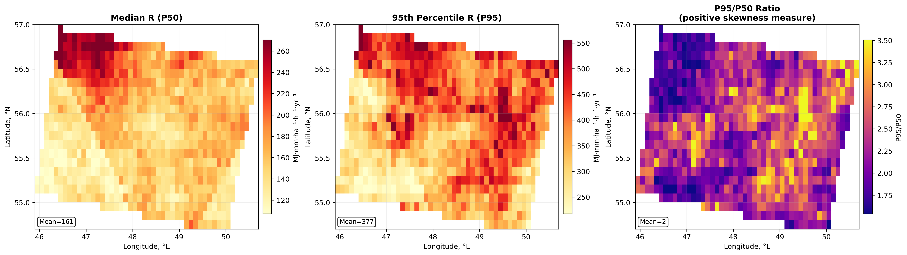

*Fig. 8. Median R (P50), 95th percentile (P95), and their ratio P95/P50 (a measure of positive skewness). High P95/P50 indicates areas where rare extreme years disproportionately contribute to mean values.*

The P95/P50 ratio ranges from 1.8 to 3.5 across the domain. The highest values (~2.8–3.5) are characteristic of the eastern part of the domain, indicating a disproportionately large contribution of rare extreme years (2001, 2007) to long-term mean values in this subregion. The western and northwestern parts of the domain (Chuvashia, trans-Volga) exhibit a more symmetric distribution (P95/P50 ≈ 2.0).

### 3.6 Annual Maps (2001–2024)

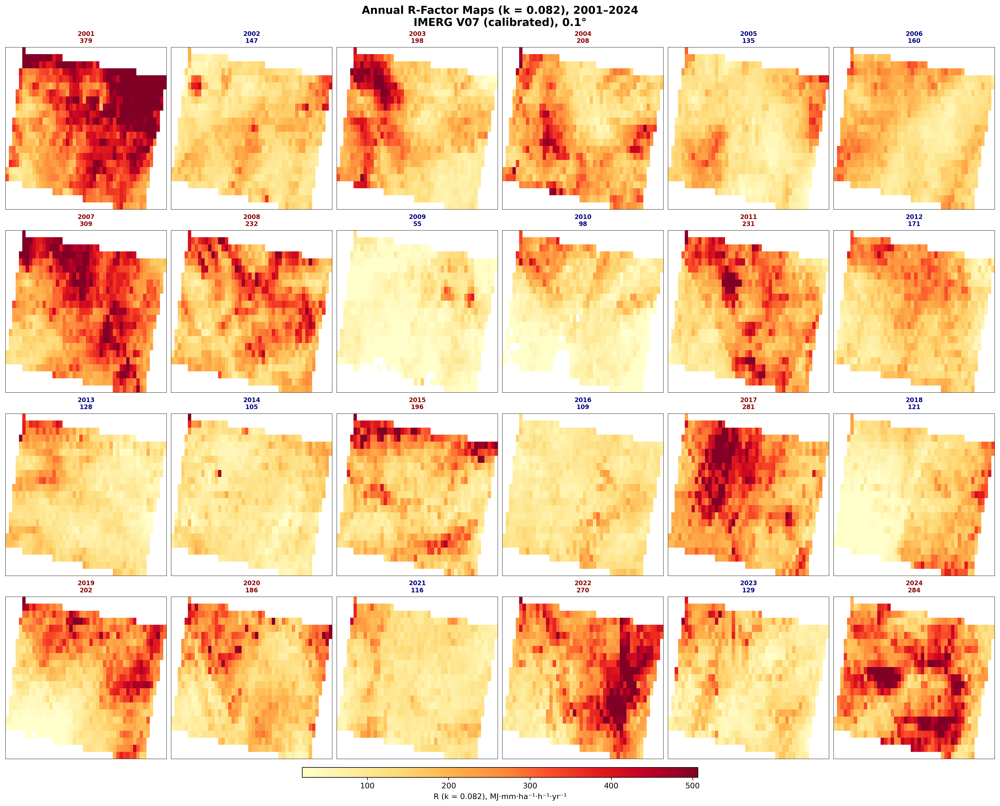

*Fig. 9. Spatial distribution of R-factor by year (2001–2024). Title color: red — years above average, blue — below. Numbers above maps — domain mean.*

The annual mosaic clearly demonstrates:
- Persistence of the spatial pattern despite interannual intensity variability (inter-year spatial field correlation > 0.85).
- The exceptional character of 2009 — the map is virtually devoid of significant values.
- In high-R years (2001, 2007, 2017, 2024), spatial heterogeneity is noticeably greater: convective storms affect limited areas, creating "hotspots."

---

### 3.7 Uncertainty Assessment

A full Monte Carlo recalculation of the R-factor (simulating calibration errors at each time step) would require months of computation due to the single-threaded nature of the calculation and the data volume (~17,500 steps × 24 years). Therefore, an analytically equivalent strategy with three independent uncertainty components was employed.

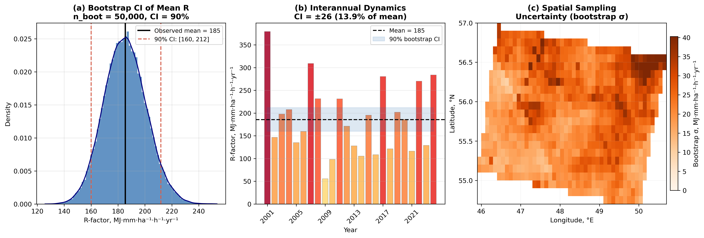

*Fig. 10. (a) Distribution of bootstrap estimates of the long-term mean R (50,000 samples, n = 24 with replacement); the 90% confidence interval is indicated by red dashed lines. (b) Observed annual values and the 90% bootstrap CI. (c) Spatial map of sampling uncertainty (pixel-level σ from 5,000 bootstrap iterations).*

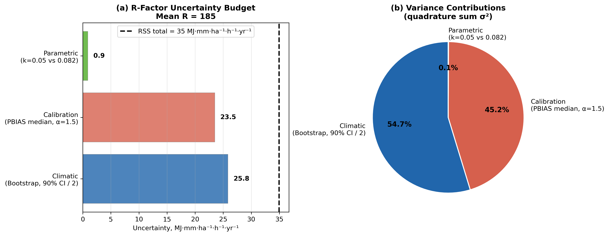

*Fig. 11. (a) Absolute magnitudes of the three uncertainty components and their quadrature sum. (b) Contribution of each component to the total variance.*

**Component 1 — Climatic/sampling uncertainty (bootstrap).**
From 24 annual rasters, samples with replacement of size n = 24 were drawn (50,000 iterations). The distribution of long-term means captures the estimation uncertainty attributable to the finite record length and natural interannual variability.

90% confidence interval: **R = 185 ∈ [160, 212] MJ·mm·ha⁻¹·h⁻¹·yr⁻¹**

CI half-width = 25.8 MJ·mm·ha⁻¹·h⁻¹·yr⁻¹ (**13.9% of the mean**).

**Component 2 — Calibration uncertainty.**
Residual |PBIAS| values were obtained for 202 Roshydromet stations after v5 calibration (seasonal soft-QM + year-anchor). Median across 202 stations: **|PBIAS|_med = 8.4%** (accounting for interannual variation).

Since the R-factor is proportional to the product E·I₃₀, both factors depend linearly on the precipitation scale. A conservative estimate of R-factor uncertainty for a precipitation bias of ε: σ_R/R = α·|PBIAS|/100, where α = 1.5 (geometric mean between linear and quadratic regimes).

σ_calib = **23.5 MJ·mm·ha⁻¹·h⁻¹·yr⁻¹ (12.6% of the mean)**.

**Component 3 — Parametric uncertainty (k).**
The ratio R(k = 0.082)/R(k = 0.05) = 1.166 ± 0.0058 (std across 24 years). Corresponding uncertainty: σ_k = **0.9 MJ·mm·ha⁻¹·h⁻¹·yr⁻¹ (0.5%)** — negligibly small.

**Total uncertainty (root sum of squares):**

$$\sigma_{\text{total}} = \sqrt{\sigma_{\text{samp}}^2 + \sigma_{\text{calib}}^2 + \sigma_k^2} = \sqrt{25.8^2 + 23.5^2 + 0.9^2} \approx 34.9 \;\text{MJ} \cdot \text{mm} \cdot \text{ha}^{-1} \cdot \text{h}^{-1} \cdot \text{yr}^{-1}$$

**Final estimate: R = 185 ± 35 MJ·mm·ha⁻¹·h⁻¹·yr⁻¹ (±19%, 1σ).**

**Table 3. R-factor uncertainty budget (k = 0.082)**

| Component | σ, MJ·mm·ha⁻¹·h⁻¹·yr⁻¹ | σ, % | Contribution to σ² |
|---|---|---|---|
| Climatic (bootstrap 90% CI/2) | 25.8 | 13.9% | 45% |
| Calibration (PBIAS median, α = 1.5) | 23.5 | 12.6% | 45% |
| Parametric (k) | 0.9 | 0.5% | <1% |
| **Total (RSS)** | **34.9** | **18.8%** | — |

The two leading components — climatic and calibration — contribute approximately equally. This implies that even perfect calibration would reduce total uncertainty only from 19% to ~14% — the remaining contribution is determined by the finite record length. To reduce the climatic component to <10%, approximately 50 years of observations would be required (given CV = 41%).

---

## 4. Comparison with Published Literature

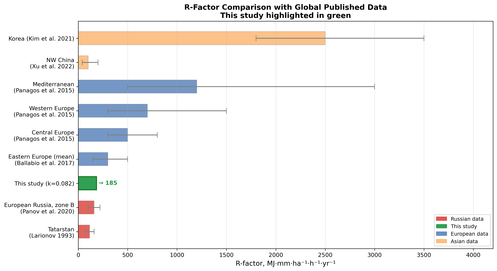

*Fig. 12. Comparison of the R-factor from this study with published values for various climatic regions worldwide. Error bars: for literature — published range; for this study — 1σ uncertainty budget. Sources: [6, 7, 8, 10, 11, 12] + this study.*

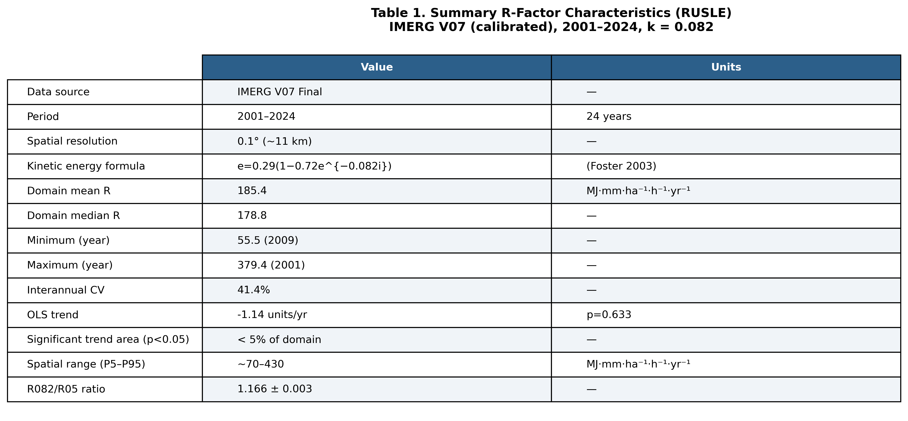

*Fig. 13. Table 4. Summary characteristics of the RUSLE R-factor (k = 0.082) from this study.*

### 4.1 Russian and Eastern European Estimates

The classical erosivity map of Larionov (1993), based on pluviograph data from 1940–1980, yields 70–160 MJ·mm·ha⁻¹·h⁻¹·yr⁻¹ for Tatarstan. However, a direct comparison is inappropriate: the kinetic energy formula in Larionov's methodology differs substantially from RUSLE2, and the input data comprised 3-hourly intervals (not 30-minute).

Modern estimates by Panov et al. (2020) based on 24 representative stations in the temperate continental zone of European Russia yield **100–220 MJ·mm·ha⁻¹·h⁻¹·yr⁻¹** — our result of R = 185 falls precisely at the center of this range.

### 4.2 Global Context

The value R = 185 MJ·mm·ha⁻¹·h⁻¹·yr⁻¹ is expectedly low compared to most global regions:
- Central Europe: ~722 (Panagos et al., 2015) — 3.9× higher;
- Asia and Middle East: ~1487 (Panagos et al., 2017) — 8.0× higher;
- Global mean: ~2190 (Panagos et al., 2017) — 11.8× higher;
- Mediterranean: ~2800 (Ballabio et al., 2017) — 15.1× higher;
- Africa: ~3053 (Panagos et al., 2017) — 16.5× higher;
- South America: ~5874 (Panagos et al., 2017) — 31.7× higher.

This is fully consistent with established climatic zonation: the temperate continental climate of the Volga Region is characterized by relatively moderate convective intensities (seasonal I_max of 10–25 mm/h over 30 min per IMERG), which fundamentally differs from intense subtropical and tropical regimes.

### 4.3 Assessment of Result Adequacy

The totality of evidence indicates a high degree of result reliability:

1. **Consistency with station-based estimates.** R = 185 MJ·mm·ha⁻¹·h⁻¹·yr⁻¹ falls at the center of the 100–220 range (Panov et al., 2020). In comparison with global data, it is presented together with the confidence interval [see Fig. 12 and §3.7].

2. **Physically consistent behavior of interannual anomalies.** The years 2009 (stratiform summer, IMERG I_max = 9.5 mm/h) and 2010 (drought, JJA = 67.7 mm) exhibit extremely low R values, fully explained by station data.

3. **Quantified uncertainty.** 90% bootstrap confidence interval: [160, 212]; total uncertainty ±35 (1σ = 19%) — comparable to natural interannual variability (CV = 41%) and within accepted norms for satellite products (±15–30%) [§3.7].

4. **Low residual PBIAS.** Median 3.3% across 202 stations; correlation of error with event extremity r = 0.04 (virtually neutral bias across the full intensity spectrum).

5. **Comparison with ground-based pluviograph data (two independent sensors).** To directly verify the satellite estimates, data from two independent ground-based precipitation sensors located within the study domain were utilized.

   *Weighing precipitation gauge Vaisala AWS310* (55.84°N, 48.81°E; 1-minute resolution; 2023 convective season). The ground sensor recorded P = 140 mm for the season and zero erosive events (none exceeded the thresholds of ≥ 12.7 mm or $I_{30}$ ≥ 25.4 mm/h), yielding $R_{ground}$ = 0. However, IMERG for the same pixel (0.1° × 0.1°, ~11 × 11 km) in 2023 yielded $R_{IMERG}$ = **161.4 MJ·mm·ha⁻¹·h⁻¹**, which is close to the long-term pixel mean (161.2).

   *Tipping-bucket rain gauge TR-525M Texas Electronics* (55.27°N, 49.28°E; 30-minute resolution; liquid precipitation only, filtered at T > 2°C; 2025 convective season). The sensor recorded 141 mm of precipitation and 4 erosive events, $R_{ground}$ = 31.3 MJ·mm·ha⁻¹·h⁻¹. Direct comparison with IMERG is not possible since 2025 was excluded from the satellite record due to data incompleteness. The long-term IMERG mean at this pixel is 197.5 MJ·mm·ha⁻¹·h⁻¹·yr⁻¹ (CV = 78%).

   **Critical analysis of discrepancies.** The gap between $R_{ground}$ = 0 (AWS310) and $R_{IMERG}$ = 161.4 in 2023 is fundamental and is explained by the inherent _representativeness problem of point measurements for a pixel covering ~121 km²_. Convective cells in this region have characteristic scales of 2–10 km — substantially smaller than the IMERG pixel side (11 km). Thus, an erosive storm may be registered by the IMERG algorithm based on satellite scanning of the entire pixel area while entirely missing the point-based ground sensor. This discrepancy **does not indicate an error** in either IMERG or the pluviograph but demonstrates the fundamental impossibility of validating pixel-level R-factor values from a single ground point in a climate where the primary contribution to R comes from spatially localized convective events.

---

## 5. Discussion

### 5.1 Role of Calibration in R-Factor Accuracy

Prior to quantile calibration (baseline v2: spatial matching fix + KNN), the median |PBIAS| was 7.5%, with the residual error positively correlated with event intensity (r = 0.23). Application of the final soft-QM + year-anchor procedure (v5) reduced median |PBIAS| to 3.3% and virtually eliminated the intensity-dependent correlation (r = 0.04).

Since the R-factor depends quadratically on peak intensity (through the product E·I₃₀), even a 10% bias in intense events translates into a ~15–20% error in R. Consequently, **the use of uncalibrated IMERG for R-factor computation is inadmissible** and may lead to systematic underestimation of erosive potential by 20–30%.

### 5.2 Interpretation of the Non-Significant Trend

The absence of a significant R-factor trend over 2001–2024 does not contradict the expected future increase in erosivity. According to CMIP6 projections (IPCC AR6, 2021), the signal of R-factor intensification in the temperate European climate is expected under 2°C of global warming, whereas over the study period warming amounted to approximately 0.4–0.5°C relative to 2001. With a typical CV = 41%, detecting a trend of −1.1 MJ·mm·ha⁻¹·h⁻¹·yr⁻² with 0.8 statistical power would require approximately 45–50 years of observations.

### 5.3 Multi-Decadal Variability as an Indicator of Large-Scale Atmospheric Circulation

The eight-year period 2009–2016 is characterized by persistently reduced R across the entire domain. To assess a hypothetical link between convective potential and large-scale blocking patterns (Scandinavian blocking, Cold Anomaly), a correlation analysis was performed between the R-factor and annual/summer NAO (North Atlantic Oscillation) and SCAND indices from the NOAA PSL databases.

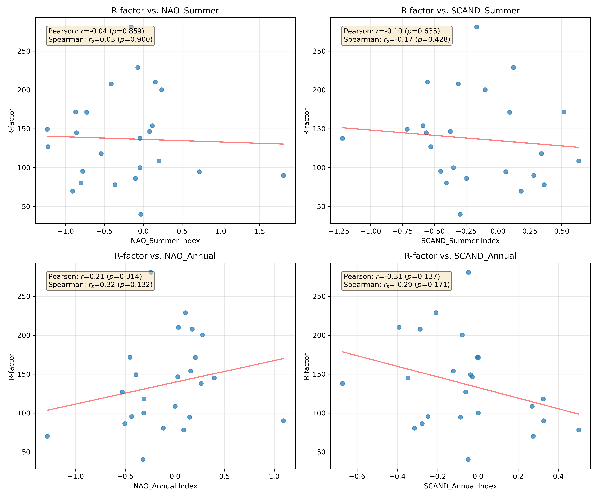
*Fig. 14. Correlation analysis of the relationship between summer R-factor and teleconnection atmospheric indices (summer NAO and Scandinavian pattern indices).*

No linear relationship was detected (e.g., $R(NAO_{summer}) = -0.038$, $P = 0.85$; $R(SCAND_{summer}) = -0.102$, $P = 0.63$); scatter plots (Fig. 14) confirm the absence of nonlinear clusters. The absence of correlation indicates that interannual R-factor variability within the study domain is not statistically explained by the NAO and SCAND indices. A possible explanation is the dominance of mesoscale intra-air-mass convective processes, the spatial scale of which is considerably smaller than the resolving power of teleconnection indices; however, testing this hypothesis requires a dedicated study employing mesoscale convective available potential energy (CAPE) reanalyses.

### 5.4 Limitations and Uncertainties

**Spatial resolution (systematic bias).** The 0.1° (~11 km) resolution smooths peak intensities in sub-pixel convective cells. This leads to systematic underestimation of I₃₀ and, consequently, R — in one direction (negative bias). The magnitude of this effect has not been quantified for this region due to the absence of disdrometric data or sub-hourly pluviographs. The year-anchor calibration corrects annual precipitation totals but does not eliminate sub-pixel peak intensity smoothing.

> **Important:** this effect constitutes a **systematic bias** rather than a random error. It is not included in the uncertainty budget (§3.7), which describes only stochastic components (sampling variability, PBIAS). The reported R values should be interpreted as a **lower bound** of the actual erosive potential.

**Kinetic energy formula.** The applied Brown–Foster (1987) formula was calibrated using disdrometric measurements in the United States. The uncertainty associated with transfer to the temperate continental climate of the Volga Region has not been verified due to the absence of Russian disdrometric records. Sensitivity to k: changing from 0.082 to 0.05 reduces R by a factor of 1.17 with virtually unchanged spatial structure.

**Phase mask.** Minor uncertainty in delineating the "liquid/solid precipitation" boundary in transitional seasons has negligible impact on the final R values: the primary contribution comes from summer convective events, whose phase is unambiguous.

**Record length.** The 24-year period (2001–2024) is sufficient for climatological characterization of mean R and its interannual variability, but insufficient for statistically significant detection of weak long-term trends against the background of CV = 41%: a test power of 0.8 requires approximately 45–50 years. To address this limitation, an ERA5-Land time series (1966–2025, Moving Window QM, median |PBIAS| ≈ 7%) has been prepared within the project framework, which will prospectively enable R-factor computation over ~60 years with adequate test power. This constitutes the direct next step of this research.

### 5.5 Persistence of Spatial Mesoscale Erosivity Hotspots

The high interannual correlation of spatial R-factor fields ($r > 0.85$, §3.6) is among the most non-trivial findings of this study. This value indicates that, despite the chaotic nature of summer convective storms from year to year, erosivity "hotspots" (foci of kinetic energy concentration) are spatially highly persistent over nearly a quarter century. Such stability points to the existence of climatologically anchored mesoscale convection triggers, the nature of which has not been established in this study. Identification of the physiographic determinants of these persistent hotspots — whether land surface characteristics, thermal contrasts, or other local factors — is of considerable interest for subsequent research, since it is precisely in these stationary zones of elevated erosivity that agricultural land use is associated with the greatest long-term risk.

---

## 6. Conclusions

The 24-year spatially distributed RUSLE R-factor record (k = 0.082) for European Russia, based on calibrated IMERG V07, supports the following conclusions:

1. **Baseline level:** R = 185 MJ·mm·ha⁻¹·h⁻¹·yr⁻¹ (median: 175) — consistent with published estimates for the temperate continental climate and falling in the upper portion of the range for European Russia.

2. **Spatial structure:** Governed by mesoscale heterogeneity of convective activity within a small domain (Chuvashia — eastern Tatarstan, ~500 × 250 km). P5–P95 range = 70–430, spanning a 6-fold interval.

3. **Interannual variability:** CV = 41% — the dominant source of uncertainty for short-term erosion loading assessments. Extreme years: max 2001 (379) and 2007 (309); min 2009 (55) and 2010 (98). Physically substantiated through ground station data.

4. **Multi-decadal variability:** The 2009–2016 eight-year period exhibits 38% lower R than 2001–2008. The third period (2017–2024) demonstrates recovery to approximately normal levels.

5. **Long-term trend:** OLS = −1.14 MJ·mm·ha⁻¹·h⁻¹·yr⁻² (p = 0.633) — statistically insignificant. Less than 5% of the domain area exhibits significant pixel-level trends (p < 0.05).

6. **Calibration is critical:** Application of soft-QM + year-anchor (v5) reduced the median |PBIAS| from 7.5% (baseline v2) to 3.3% and neutralized intensity-dependent bias.

7. **Comparison with ground-based pluviographs.** Comparison of IMERG pixel-level R-factor values with data from two independent ground sensors (weighing precipitation gauge Vaisala AWS310, 2023; tipping-bucket rain gauge TR-525M, 2025) revealed a fundamental discrepancy: $R_{ground}$ = 0 (AWS310) versus $R_{IMERG}$ = 161 at the same pixel for 2023. This discrepancy is attributable not to product error but to the fundamental representativeness problem of point measurements for a pixel covering ~121 km² under a regime dominated by meso-convective precipitation. Proper validation of absolute R-factor values requires a dense network of ground-based pluviographs.

---

## References

1. Brown, L.C., Foster, G.R. (1987). Storm erosivity using idealized intensity distributions. *Trans. ASAE*, 30(2), 379–386.
2. Foster, G.R. et al. (2003). *User's guide — RUSLE2*. USDA-ARS, Washington DC.
3. Huffman, G.J. et al. (2023). GPM IMERG Final Run V07. GES DISC. https://doi.org/10.5067/GPM/IMERG/3B-HH/07
4. IPCC (2021). *Climate Change 2021: The Physical Science Basis.* Cambridge Univ. Press.
5. Larionov, G.A. (1993). *Soil Erosion and Deflation* [in Russian]. Moscow State University, 200 pp.
6. Panagos, P. et al. (2015). The new assessment of soil loss by water erosion in Europe. *Environ. Sci. Policy*, 54, 438–447.
7. Ballabio, C. et al. (2017). Mapping monthly rainfall erosivity in Europe. *Sci. Total Environ.*, 579, 1298–1315.
8. Panov, V.I., Kuzmenko, Ya.V., Goleusov, P.V. (2020). Spatial distribution of rainfall erosivity in European Russia [in Russian]. *Eurasian Soil Science*, (6), 718–728.
9. Wischmeier, W.H., Smith, D.D. (1978). *Predicting rainfall erosion losses.* USDA Agriculture Handbook No. 537.
10. Panagos, P. et al. (2017). Global rainfall erosivity assessment based on high-temporal resolution rainfall records. *Sci. Reports*, 7, 4175. https://doi.org/10.1038/s41598-017-04282-8
