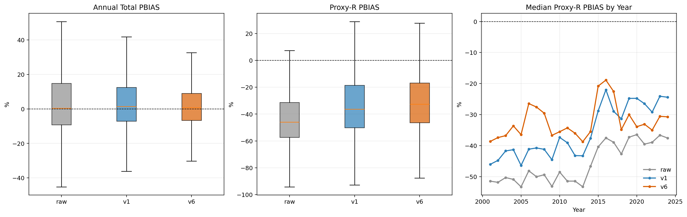
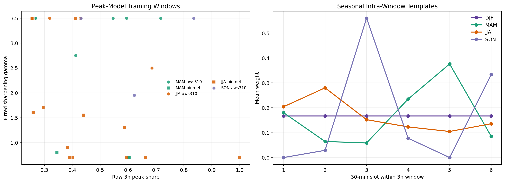
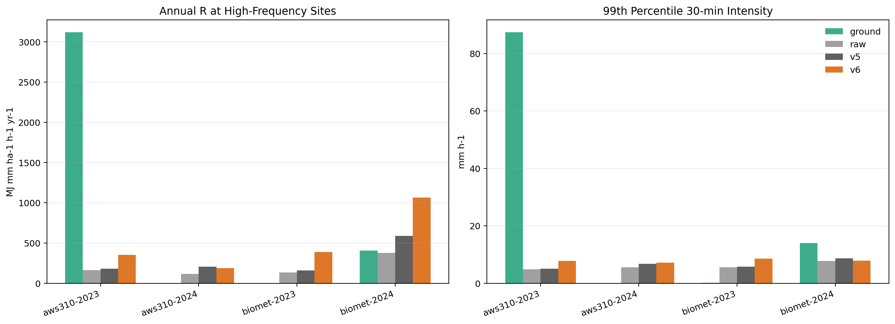
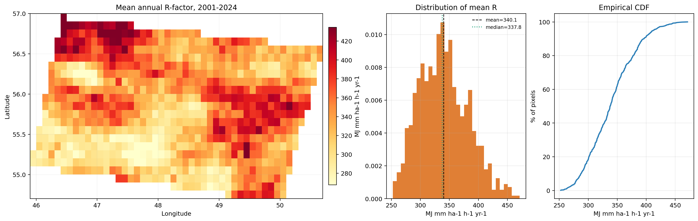
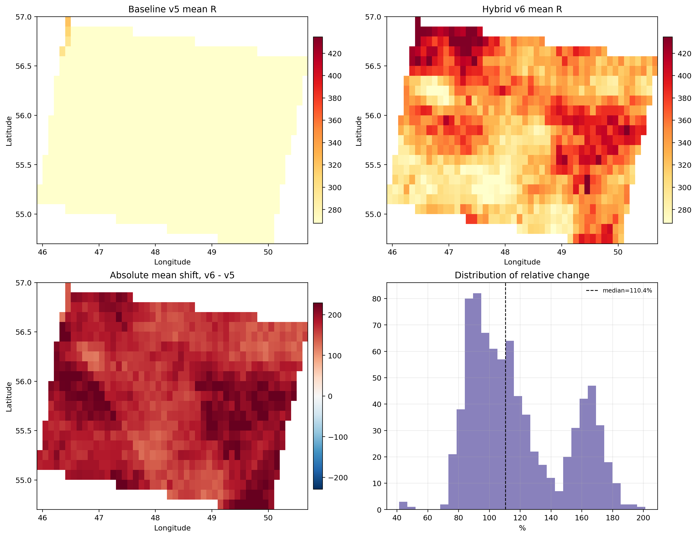
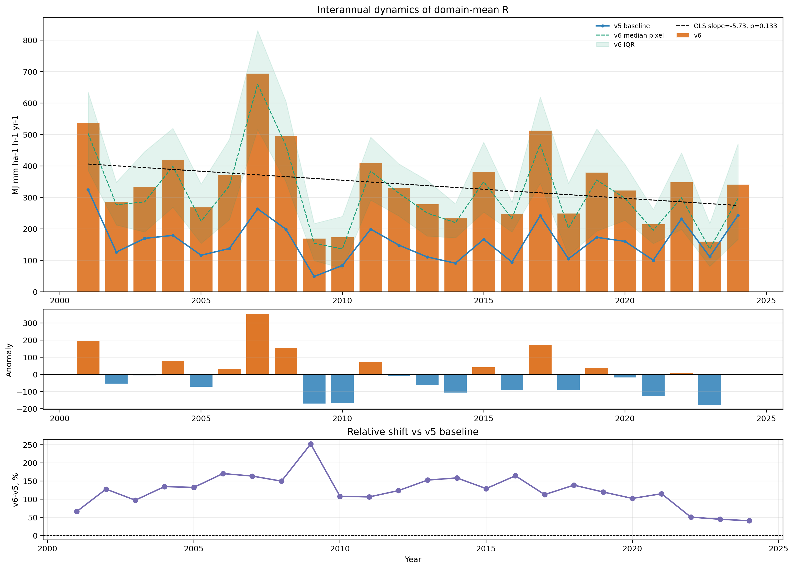
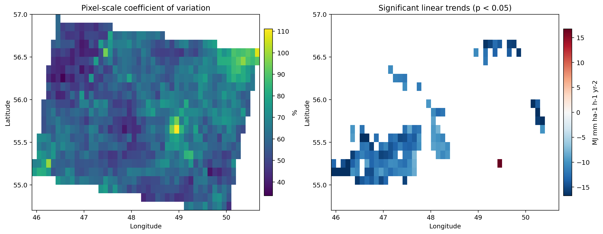

# Оценка фактора дождевой эрозионной агрессивности в условиях дефицита высокочастотных осадков: теоретические предпосылки, источники данных и региональная калибровка IMERG для Поволжья

## Аннотация
Фактор дождевой эрозионной агрессивности `R` является ключевым климатическим входом для семейства моделей USLE/RUSLE/RUSLE2, однако именно он чаще всего оценивается наименее надежно. Причина состоит в том, что прямой расчет `R` требует не просто рядов осадков, а высокочастотных измерений интенсивности на уровне отдельных событий. Для вычисления `EI30` необходимы данные как минимум 15-минутного, а предпочтительно breakpoint-разрешения, причем на достаточно длинном интервале наблюдений. В реальных региональных задачах такие данные редки, коротки, неоднородны по качеству и пространственно разрежены. Поэтому большинство прикладных работ вынуждены использовать суррогаты: дневные и месячные proxy-индексы, интерполированные станции, радиолокационные поля, спутниковые продукты и реанализационные данные. Каждая из этих групп источников данных решает одну проблему, но создает другую.

Настоящий текст построен не как описание очередной версии алгоритма, а как полная рукопись, начинающаяся с постановки проблемы: что именно представляет собой `R`-фактор, какие данные нужны для его корректного расчета, почему в большинстве регионов их нет, какие существуют компромиссные пути, и где проходит граница между допустимым упрощением и методологической подменой. На этом фоне проект по Поволжью рассматривается как частный, но показательный пример задачи data-limited erosivity estimation.

В проекте использованы GPM IMERG Final Run V07 (`2001-2024`), архив `202` парных station-IMERG калибровочных таблиц, два независимых высокочастотных поста (`AWS310`, `Biomet`) и фазовые маски ERA5-Land для корректного расчета `RUSLE2 R`. На этой базе реализована предиктивная support-aware схема калибровки: скользящее окно `±7` лет с исключением целевого года, мягкое смешивание `4` ближайших станций, сезонное quantile mapping с erosivity-aware выбором силы поправки, реконструкция 30-минутных пиков внутри 3-часовых окон и мягкие гидрологические ограничения. Предиктивная проверка на `4848` station-years показала снижение медианной абсолютной ошибки годовой суммы осадков с `9.23%` до `7.69%` и медианной абсолютной ошибки proxy-`R` с `38.18%` до `34.00%` по сравнению с прежним предиктивным baseline.

Однако главный вывод работы не сводится к тому, что «новая версия стала лучше». Более важен другой результат: при переходе от amount-oriented к peak-oriented калибровке неизбежно проявляется проблема `area-to-point scaling`. Консервативная площадная оценка `R_area` для региона составляет `159.2 MJ mm ha-1 h-1 yr-1`, тогда как точечно-эквивалентная пиково-ориентированная оценка `R_point_eq` достигает `340.1 MJ mm ha-1 h-1 yr-1`. Это различие нельзя честно трактовать как ошибку одной из карт; оно отражает фундаментальную неоднозначность между площадным пикселем осадков и полевым erosive forcing.

С практической точки зрения статья приводит к трем выводам. Во-первых, выбор источника данных для `R` должен зависеть от того, нужна ли площадная климатология или точечно-эквивалентная оценка опасности. Во-вторых, спутниковые и реанализационные продукты без локальной привязки могут быть полезны как базовый forcing, но не как готовая истина о `EI30`. В-третьих, если высокочастотные эталонные данные отсутствуют, научно корректнее публиковать консервативный площадной продукт и явно сообщать о границах интерпретации, чем выдавать единственную карту за точное представление эрозионной агрессивности.

**Ключевые слова:** rainfall erosivity, R-factor, RUSLE2, pluviograph, IMERG, radar, reanalysis, area-to-point scaling, peak reconstruction, Поволжье

## 1. Введение
Водная эрозия остается одной из наиболее распространенных форм деградации почв, а фактор дождевой агрессивности `R` — одной из самых чувствительных переменных в моделях потенциального смыва. На уровне формулы USLE/RUSLE/RUSLE2 этот фактор выглядит как один из нескольких множителей, однако в содержательном смысле он задает климатическую силу воздействия, то есть интенсивность и энергию дождей, способных инициировать detachment и transport. Ошибка в `R` не всегда доминирует над ошибками в `K`, `LS`, `C` или `P`, но именно она чаще всего оказывается наиболее трудной для честной количественной оценки.

Причина известна давно. Осадки как климатический ряд измеряются почти везде; осадки как последовательность эрозионно значимых штормов измеряются редко. Для гидрологии часто достаточно суточных сумм, для климатологии — месячных и годовых, но для `R` нужны данные о внутриштормовой структуре. Иными словами, проблема состоит не просто в нехватке дождемеров, а в нехватке дождемеров нужного временного разрешения и нужной длины ряда. Этим объясняется парадокс: в эпоху глобальных спутниковых осадков и реанализационных продуктов вопрос «откуда брать данные для `R`?» остается открытым.

Во многих работах этот дефицит закрывают proxy-подходами: используют Modified Fournier Index, регрессии на месячные суммы, дневные эмпирические модели или borrowed coefficients из соседних регионов. Такие решения иногда неизбежны, но они не равнозначны прямому расчету `EI30`. Чем ближе задача к event-scale или field-scale интерпретации, тем дороже становится любая потеря временного разрешения и тем опаснее становится перенос внешних коэффициентов без локальной калибровки.

С другой стороны, современная ситуация уже не сводится к альтернативе «есть плювиограф или ничего нет». Появились радиолокационные архивы, спутниковые продукты типа IMERG, высокоразрешающие реанализационные данные и многоканальные merged datasets. Они создают новую исследовательскую возможность: собирать `R` не только из прямых записей, но и из иерархии источников разного типа, при условии что различия их пространственной и временной поддержки явно учитываются. Именно здесь возникает центральный для данной рукописи вопрос: как строить оценку `R`, если прямые высокочастотные наблюдения доступны лишь частично?

Эта статья отвечает на вопрос в два шага. Сначала рассматриваются теоретические и методические основания задачи: как определяется `R`, какие данные требуются, какие классы источников вообще существуют и что каждый из них способен дать. Затем на материале Поволжья показывается, как из ограниченного, но разнородного набора данных можно получить более содержательную и более честную оценку эрозионной агрессивности, чем при наивном использовании одной только спутниковой климатологии.

## 2. Теоретические предпосылки: что именно нужно для расчета `R`

### 2.1. Определение фактора `R`
В оригинальной логике USLE/RUSLE фактор `R` представляет собой среднегодовую сумму эрозионности отдельных штормов. Для каждого erosive event вычисляется произведение кинетической энергии осадка `E` и максимальной 30-минутной интенсивности `I30`, после чего значения суммируются по году и усредняются по многолетнему периоду. В современных реализациях семейства моделей, особенно в `RUSLE2`, важны как способ разделения дождей на события, так и точная формула связи между интенсивностью и кинетической энергией.

Это означает, что `R` не является простой функцией годовой суммы осадков. Два года с одинаковым количеством выпавшей воды могут иметь принципиально разную эрозионную агрессивность, если в одном году доминируют длительные умеренные дожди, а в другом — короткие конвективные всплески. Поэтому любая методика, работающая только с суммами, описывает не сам `R`, а некоторый суррогат климатической влажности, лишь отчасти с ним связанный.

Важна и внутренняя эволюция методики. Исторический обзор Nearing et al. показывает, что переход от `USLE` к `RUSLE` и далее к `RUSLE2` сопровождался не только заменой коэффициентов, но и пересмотром самой связи между интенсивностью дождя и его энергией [Nearing et al., 2017](https://www.sciencedirect.com/science/article/abs/pii/S0341816217301960). Следовательно, смешивать старые и новые формулы без явной оговорки нельзя: это создает структурную неоднородность в самом определении целевой величины.

### 2.2. Почему прямой расчет редок
С научной точки зрения золотой стандарт для `R` — это длинный ряд высокочастотных pluviograph или breakpoint-записей. Научный документ RUSLE2 прямо указывает, что для построения эрозионной климатологии нужны данные 15-минутных дождемеров, а еще лучше — breakpoint-записи интенсивности [USDA RUSLE2 Science Documentation](https://www.ars.usda.gov/ARSUserFiles/60600505/rusle/rusle2_science_doc.pdf). На практике это требование означает сразу несколько ограничений:

1. Нужен не просто дождемер, а самописец или цифровой сенсор нужного разрешения.
2. Нужен достаточно длинный период, обычно не менее `15-20` лет, иначе климатология будет слишком чувствительна к редким экстремумам.
3. Нужен контроль качества временной структуры ряда, а не только его суммарных значений.
4. Нужна согласованность аппаратуры и правил регистрации во времени.

Именно поэтому во многих странах архивы, пригодные для прямого расчета `R`, покрывают лишь небольшое число пунктов. Для больших территорий возникает типичная ситуация: пространственное покрытие есть только у суточных или месячных сумм, а event-scale информация существует фрагментарно.

### 2.3. Пространственная и временная поддержка данных
Почти все споры вокруг `R` в действительности являются спорами о support. Классический плювиограф измеряет точку, радар — площадь в километровом пикселе, спутник — площадь порядка `0.1°`, реанализ — модельно согласованную ячейку, а прокси на месячных суммах вообще оперируют интегральной величиной без штормовой структуры. Эти данные не взаимозаменяемы, даже если измеряют один и тот же физический процесс.

Из этого следуют два важных вывода. Во-первых, нельзя автоматически считать, что более высокое пространственное покрытие компенсирует потерю временного разрешения. Во-вторых, сравнение point gauge и satellite pixel без explicit support statement методологически неполно. Именно в такой логике далее вводится различие между `R_area` и `R_point_eq`.

## 3. Откуда вообще брать данные для расчета `R`: классы источников и их пределы

### 3.1. Обзор классов данных
Для практической работы полезно разделить все потенциальные источники данных на шесть классов.

| Класс данных | Типичная временная поддержка | Пространственная поддержка | Что дает | Главные ограничения | Наиболее честная интерпретация |
|---|---|---|---|---|---|
| Плювиографы / breakpoint gauges | `1-15` мин | Точка | Прямой расчет `EI30` | Редкость, короткие и неоднородные ряды | Эталонный point-support `R` |
| Обычные станции с суточными/месячными суммами | `1` день или `1` месяц | Точка | Proxy-индексы, региональные регрессии | Потеря внутриштормовой структуры | Консервативный климатический суррогат |
| Радиолокационные поля | `5-60` мин | Км-пиксель | Пространственная event-scale структура | Артефакты, короткие архивы, калибровка по дождемерам | Area-scale `R`, близкий к event mapping |
| Спутниковые продукты (IMERG, TRMM, CMORPH) | `30` мин - `3` ч | Пиксель `~0.1°` и крупнее | Глобальное покрытие и единообразие | Сглаживание хвоста и area-to-point mismatch | Площадная климатология, базовый forcing |
| Реанализационные данные (ERA5, ERA5-Land и др.) | `1` ч и грубее | Модельная сетка | Полная непрерывность и сопутствующие переменные | Модельная природа осадка и сглаживание конвекции | Поддерживающий источник или covariate field |
| Многоканальные merged/ML продукты | От `30` мин до месяца | Пиксель / сетка | Лучший компромисс покрытия и калибровки | Наследование чужих bias и скрытых допущений | Региональная climatology-ready оценка |

Эта классификация удобна тем, что переводит разговор из абстракции в инженерную постановку: вопрос уже не в том, «какие данные хотелось бы иметь», а в том, какой класс данных доступен и какую интерпретацию он действительно позволяет.

### 3.2. Плювиографы и цифровые высокочастотные дождемеры
Если в регионе существует сеть надежных 5-15-минутных или breakpoint-записей, именно она должна быть ядром оценки `R`. Это не вопрос вкуса, а вопрос definitional compatibility: только такой архив позволяет напрямую вычислять `EI30` без внешних суррогатов. Именно на таких данных основаны фундаментальные национальные и глобальные калибровки erosivity [Panagos et al., 2017](https://www.nature.com/articles/s41598-017-04282-8).

Проблема в том, что пространственная плотность таких сетей обычно мала, а архивы часто неоднородны. Дополнительная трудность состоит в том, что даже богатая point-support сеть не решает автоматически задачу построения непрерывной карты: интерполяция экстремальных величин сама по себе проблематична, что хорошо показано в европейской дискуссии вокруг карты Panagos et al. и комментария Auerswald et al. [Panagos et al., 2015](https://www.sciencedirect.com/science/article/pii/S004896971500051X), [Auerswald et al., 2015](https://www.sciencedirect.com/science/article/pii/S0048969715004658).

### 3.3. Суточные и месячные станции: proxy-модели как вынужденный компромисс
Там, где высокочастотных рядов нет, используют proxy-показатели, основанные на дневных, месячных или годовых суммах. Наиболее известны различные формы Modified Fournier Index и региональные регрессии между `R` и агрегированными осадками. Эти подходы позволяют построить первую аппроксимацию, но их нельзя считать прямой оценкой `EI30`.

Работы последнего десятилетия подчеркивают, что качество таких proxy зависит от локальной калибровки. Например, в исследовании для Лёссового плато Китая переход от грубых monthly proxies к более детальным связям заметно меняет точность и устойчивость реконструкции [Ma et al., 2022](https://doi.org/10.1016/j.catena.2022.106373). Практический вывод жесткий: если используются суточные или месячные суммы, коэффициенты должны быть локально калиброваны по хотя бы подмножеству высокочастотных станций. Слепой перенос формулы из другой климатической зоны методически слаб.

### 3.4. Радиолокационные данные
Метеорологический радар снимает главное ограничение точечных наблюдений: он дает пространственную структуру штормов с достаточно высокой частотой и потому особенно привлекателен для erosivity mapping. В идеальном случае radar-gauge система ближе всего к тому типу данных, который нужен для event-scale `R`.

Однако у радара свои проблемы: экранирование, яркостные артефакты, остаточный clutter, смена технологий и сравнительно короткие непрерывные архивы. Европейские работы показывают, что даже bias-corrected radar products требуют осторожной интерпретации и могут систематически завышать или искажать erosivity там, где остаточные артефакты не устранены полностью [Matthews et al., 2025](https://journals.plos.org/water/article?id=10.1371/journal.pwat.0000408). Поэтому радар — не автоматическая истина, а сильный, но требовательный источник area-scale информации.

### 3.5. Спутниковые осадки
Спутниковые продукты радикально меняют практическую постановку задачи, потому что дают почти глобальное, единообразное по методике покрытие. Для erosion studies это особенно важно в data-poor регионах, где сеть станций редка или недоступна. Среди современных продуктов IMERG интересен тем, что имеет 30-минутное разрешение и длинный непрерывный ряд, а потому лучше других подходит для попытки event-aware оценки erosivity.

Но глобальное покрытие не отменяет фундаментальных ограничений. Уже для TRMM было показано, что 3-часовой спутниковый шаг не способен адекватно восстановить highly erosive events [Vrieling et al., 2010](https://doi.org/10.1016/j.jhydrol.2010.10.035). Новые работы по IMERG формулируют ту же проблему мягче, но по сути так же: IMERG полезен как динамический rainfall input, но без наземной привязки склонен занижать erosivity, особенно в хвосте событий [Emberson et al., 2023](https://doi.org/10.5194/hess-27-3547-2023), [Fenta et al., 2023](https://www.sciencedirect.com/science/article/pii/S0022169423004973).

### 3.6. Реанализационные продукты
Реанализы привлекательны тем, что обеспечивают полное пространственно-временное покрытие и одновременно дают атмосферные переменные, потенциально полезные для описания конвективной среды: `CAPE`, `TCWV`, freezing level, wind shear и т.д. Однако осадки в реанализе не являются прямым измерением; это модельно ассимилированная величина. Поэтому использовать реанализ как единственный источник `R` рискованно, особенно если задача связана с короткими пиками.

Наиболее разумная роль реанализа — не замещать высокочастотный rainfall forcing, а выступать в роли covariate source или поддерживающего масштабирующего поля. Именно в таком качестве ERA5-Land в данной работе использован для фазовой диагностики и рассматривается как перспективный источник будущих признаков для event-aware моделей.

### 3.7. Многоканальные blended и ML-ориентированные наборы данных
Современный тренд в мировой литературе состоит в том, чтобы не выбирать между gauge, satellite и reanalysis, а объединять их. Хороший пример — GloRESatE, объединяющий несколько глобальных precipitation products и тысячные сети станций в единую monthly rainfall erosivity базу [Panagos et al., 2024](https://www.nature.com/articles/s41597-024-03756-5). Такие продукты часто оказываются лучшими для крупномасштабной климатологии.

Однако merged dataset не делает проблему поддержки данных невидимой. Он лишь поднимает ее на следующий уровень: теперь нужно понимать, какой именно support имеет итоговая оценка и какие скрытые предположения использовались при обучении или слиянии.

### 3.8. Практическая иерархия источников данных
Если формулировать вопрос утилитарно — откуда брать данные для `R` в новом регионе, — то иерархия решений выглядит так:

1. Если есть длительные breakpoint или 5-15-минутные ряды, они являются основой прямого расчета.
2. Если есть плотный radar-gauge архив, его стоит использовать для area-scale event mapping и привязки к station records.
3. Если есть только спутник, IMERG или другой high-frequency product можно брать как базовый forcing, но с обязательной локальной калибровкой.
4. Если есть только суточные и месячные станции, допустимы proxy-подходы, но лишь как консервативная climatology-level оценка.
5. Если нет ни одного высокочастотного эталона, point-equivalent `R` публиковать рискованно; честнее ограничиться `R_area` и открыто заявить об этом.

## 4. Постановка задачи для Поволжья
На материале Поволжья проблема проявляется в чистом виде. Регион не относится ни к классическим humid subtropical поясам с экстремально высокой erosivity, ни к территориям с плотной и длинной сетью pluviograph-наблюдений. При этом именно здесь ошибка в оценке летних конвективных всплесков способна существенно изменить годовой `R`, не вызывая сильных отклонений в годовой сумме осадков. Следовательно, на уровне обычной климатологии дождя задача может выглядеть умеренной, но на уровне erosivity она остается чувствительной к верхнему хвосту событий.

С практической точки зрения это означает, что ни один единичный источник данных не является достаточным:

1. Полноценной сети длительных высокочастотных станций нет.
2. Одни только суточные или месячные суммы слишком грубы для `EI30`.
3. Один только спутник дает нужное покрытие, но сглаживает пик и измеряет площадь, а не точку.
4. Реанализ полезен как поддерживающее поле, но не как финальный ответ по erosivity.

Именно поэтому проект был поставлен не как «построение еще одной карты осадков», а как задача support-aware реконструкции эрозионной агрессивности из ограниченного набора разнородных данных.

## 5. Цель, исследовательские вопросы и гипотезы

### 5.1. Цель
Цель исследования состояла в построении научно интерпретируемой и практически полезной оценки дождевой эрозионной агрессивности для Поволжья, основанной на явном учете ограничений исходных данных и разницы между площадной и точечной поддержкой осадков.

### 5.2. Исследовательские вопросы
В работе решались следующие вопросы.

1. Какой класс данных может служить базой для расчета `R` в регионе, где прямые pluviograph-архивы ограничены?
2. Можно ли использовать IMERG как пространственно полный forcing, не сводя задачу к простой поправке годовой суммы?
3. Насколько важно для `R` явное восстановление внутрисобытийных пиков, а не только сезонная корректировка сумм?
4. Можно ли получить один итоговый продукт, или support mismatch требует публикации пары оценок?

### 5.3. Гипотезы
Были сформулированы следующие рабочие гипотезы.

1. В условиях ограниченного наземного архива наилучший базовый forcing для региона дает спутниковый high-frequency продукт, но только после локальной предиктивной калибровки.
2. Алгоритм, оптимизированный под erosivity-sensitive метрики, должен превосходить amount-oriented baseline.
3. Жесткая nearest-station коррекция должна проигрывать мягкому многопунктовому смешиванию.
4. Без реконструкции суб-3-часовой структуры нельзя претендовать на point-equivalent интерпретацию `R`.
5. Итог должен быть представлен не одной картой, а как минимум парой `R_area` и `R_point_eq`.

## 6. Материалы

### 6.1. Использованные наборы данных
В исследовании использованы четыре основных класса входной информации.

| Набор данных | Содержание | Роль |
|---|---|---|
| GPM IMERG Final Run V07 | Полу-часовые поля осадков `2001-2024` | Основной пространственно полный rainfall forcing |
| Парный station-IMERG архив | `202` станции, 3-часовые пары `P_sat_mm` и `P_station_mm`, всего `4848` station-years | Обучение и предиктивная верификация калибровки |
| Высокочастотные точки `AWS310`, `Biomet` | Полу-часовые ряды осадков | Обучение и независимая проверка реконструкции пиков |
| ERA5-Land phase masks | Поля фазового состояния осадков | Корректный расчет `RUSLE2 R` |

Такой набор данных типичен для реальной региональной задачи: полноценной сети эталонных pluviograph-записей нет, но есть комбинация спутникового покрытия, стандартных станций и нескольких high-frequency опорных точек. Именно под такой класс задач и ориентирована предлагаемая методическая схема.

### 6.2. Что уже существовало к началу работы
К моменту начала разработки существовала рабочая версия продукта, пригодная для практического использования. Однако ее логика была в основном воднобалансовой: она стремилась сделать IMERG похожим на station totals и частично использовала информацию целевого года. Для обычной карты осадков это приемлемо; для `R` — недостаточно. Поэтому новая работа не «исправляла отдельные коэффициенты», а меняла саму постановку задачи.

## 7. Методы

### 7.1. Общая логика
Предлагаемая схема строится вокруг идеи, что в data-limited задаче нельзя полностью восстановить истинный point-support `EI30`, но можно существенно улучшить его приближение, если:

1. отделить задачу площадной климатологии от задачи point-equivalent интерпретации;
2. использовать спутник как базовый forcing, а не как готовую истину;
3. обучать поправки предиктивно, без утечки same-year информации;
4. включить в целевую функцию не только суммы осадков, но и эрозионно значимые хвосты;
5. отдельно восстанавливать внутриокошную структуру событий.

### 7.2. Прямой расчет финального `R`
Финальная эрозионная агрессивность вычислялась реализацией `RUSLE2`, а не упрощенной суррогатной формулой. Это важно методологически: задача работы состоит не в построении еще одного rainfall proxy, а в максимальном приближении к physically interpretable `R`. ERA5-Land фазовые маски использовались для корректного разделения жидкой и твердой фазы осадков в финальном расчете.

### 7.3. Предиктивное обучение по скользящему окну
Для каждого целевого года модели обучались на скользящем окне `±7` лет с явным исключением самого целевого года. Если окно было слишком коротким, использовались все доступные нецелевые годы. Эта схема устраняет ключевую слабость same-year anchor и делает верификацию честно out-of-sample.

### 7.4. Мягкое пространственное смешивание
Каждая ячейка растра корректировалась не одной ближайшей станцией, а смесью `4` ближайших пунктов с весами обратной степени расстояния:

`w_i ~ 1 / d_i^1.75`, `sum(w_i) = 1`.

Такой подход уменьшает искусственные швы, возникающие при жестком Voronoi-разбиении, и лучше соответствует тому, как реально распространяются ошибки осадка на мезомасштабе.

### 7.5. Сезонное quantile mapping с erosivity-aware отбором силы поправки
Для каждой станции и сезона строились эмпирические функции перехода между `P_sat_mm` и `P_station_mm`. Однако итоговая сила поправки задавалась не полным переходом к station-like значению, а смешением сырого и откалиброванного сигнала:

`P_v6 = P_raw + alpha * (P_qm - P_raw)`.

Коэффициент `alpha` выбирался по составному критерию

`J = 0.70*KGE_month + 0.40*KGE_day - 0.003*|PBIAS_month| - 0.002*|PBIAS_day| - 0.006*|PBIAS_proxyR| - 0.003*|Bias_q99|`,

что принципиально меняет смысл калибровки: модель теперь борется не только за согласование водного баланса, но и за частичное восстановление erosivity-sensitive верхнего хвоста.

### 7.6. Реконструкция 30-минутных пиков
После калибровки 3-часовых сумм выполнялось восстановление внутриокошной структуры события. Для каждого 3-часового окна использовались шесть 30-минутных слотов. По двум high-frequency площадкам подбиралась модель заострения весов слотов:

`w*_k = w_k^gamma / sum(w_k^gamma)`.

Параметр `gamma` предсказывался по величине скорректированной 3-часовой суммы, доле сырого пика внутри окна, числу wet-slots и сезонным индикаторам. Диапазон допустимых значений ограничивался `0.7-3.5`. Если выпадения в сыром окне не было, но скорректированная сумма была положительной, использовались сезонные шаблоны перераспределения.

Этот блок не делает продукт «полностью физическим», но возвращает именно ту часть структуры, которая теряется в area-averaged satellite rainfall и критична для `I30`.

### 7.7. Гидрологические ограничения
После основной калибровки применялись суточные и годовые ограничения, но не в жестком, а в мягком режиме. Они должны были удерживать продукт в правдоподобном диапазоне, не уничтожая восстановленный хвост.

### 7.8. Многоуровневая верификация
Верификация проводилась на трех уровнях.

1. **Station-level predictive CV** по `202` станциям и `2001-2024`.
2. **High-frequency diagnostics** по `AWS310` и `Biomet`.
3. **Map-level diagnostics** по итоговым картам `R`.

В station-level анализе использовался также proxy-`R` на 3-часовом шаге:

`R_proxy = sum(P_i * (P_i / 3))`,

который не равен `EI30`, но чувствителен к тем же ошибкам в верхнем хвосте.

### 7.9. Два итоговых продукта
Итог работы намеренно формулируется как пара продуктов.

1. `R_area` — консервативная площадная интерпретация, сохраняющая логику area-averaged forcing.
2. `R_point_eq` — точечно-эквивалентная пиково-ориентированная оценка, в которой часть субпиксельных пиков восстановлена статистически.

Ключевая научная идея состоит в том, что публиковать только одну из них без оговорок было бы менее честно, чем показывать обе.

## 8. Результаты

### 8.1. Предиктивная верификация по station archive
Главный тест новой схемы — не визуальное качество карт, а строгая предиктивная проверка на `4848` station-years.

*Рис. 1. Предиктивная верификация сырого IMERG, прежнего предиктивного baseline и новой support-aware схемы.*

| Метрика | Raw | Baseline (`v1`) | New support-aware (`v6`) |
|---|---:|---:|---:|
| Медианная абсолютная ошибка годовой суммы, % | 11.15 | 9.23 | **7.69** |
| Медианная абсолютная ошибка proxy-`R`, % | 46.91 | 38.18 | **34.00** |
| Медианный суточный `KGE` | 0.536 | 0.530 | **0.536** |
| Медианный wet-window `CSI` | 0.1166 | 0.1163 | **0.1174** |
| Медианный `p99` смоделированной интенсивности, `mm h-1` | 2.82 | 3.13 | **3.33** |
| Медианный наблюдаемый `p99`, `mm h-1` | 5.09 | 5.09 | 5.09 |

Эти результаты важны по двум причинам. Во-первых, новая схема улучшает не только воднобалансовые показатели, но и метрики, связанные с erosivity. Во-вторых, масштаб улучшения остается умеренным, а не чудесным: даже после калибровки верхний хвост интенсивностей остается заниженным, что подтверждает фундаментальную трудность задачи.

### 8.2. Диагностика пиковой реконструкции

*Рис. 2. Обучающие окна и сезонные шаблоны для внутриокошной реконструкции 30-минутных пиков.*

Пиковая модель обучена всего на `28` окнах. Это мало для универсальной региональной конвективной климатологии, но достаточно, чтобы показать принципиальный факт: IMERG внутри 3-часового окна систематически дает более плоскую структуру, чем наземные высокочастотные измерения. Диапазон `gamma` от `0.7` до `3.5` и сезонные различия шаблонов подтверждают, что фиксированное симметричное disaggregation-правило было бы слишком грубым.

### 8.3. High-frequency point-scale проверка

*Рис. 3. Сравнение годового `R` и верхнего хвоста интенсивностей на двух независимых high-frequency площадках.*

Содержательно самые важные результаты здесь не в средних значениях, а в их разнонаправленности.

Для `AWS310` в `2023` году наземный `R` составил `3118.9 MJ mm ha-1 h-1 yr-1`, тогда как спутниковые продукты дали:

| Продукт | Годовой `R` | Ошибка по `R`, % |
|---|---:|---:|
| Raw | 162.4 | -94.8 |
| Baseline (`v5`) | 179.3 | -94.3 |
| Support-aware (`v6`) | 354.0 | -88.6 |

Для `Biomet` в `2024` году наземный `R` был `406.4`, а спутниковые оценки выглядели так:

| Продукт | Годовой `R` | Ошибка по `R`, % |
|---|---:|---:|
| Raw | 377.9 | -7.0 |
| Baseline (`v5`) | 589.9 | +45.1 |
| Support-aware (`v6`) | 1065.3 | +162.1 |

Медианная сводка по двум валидным site-years:

| Продукт | Годовая сумма PBIAS, % | Годовой `R` PBIAS, % | `p99` bias, % | Wet 3h `CSI` |
|---|---:|---:|---:|---:|
| Raw | 66.67 | -50.91 | -69.68 | 0.0962 |
| Baseline (`v5`) | 84.05 | -24.55 | -66.03 | 0.0969 |
| Support-aware (`v6`) | **58.10** | +36.73 | -67.55 | **0.1089** |

Эта неоднозначность принципиальна. Она показывает, что корректная интерпретация продукта не может быть сведена к тезису “новая модель ближе к истине”. На разных точках один и тот же пиксельный продукт может оставаться недокорректированным или становиться перекорректированным. Именно поэтому high-frequency верификация скорее выявляет support mismatch, чем окончательно «доказывает» абсолютную точность карты.

### 8.4. Площадная и точечно-эквивалентная итоговые оценки

*Рис. 4. Пространственное распределение и статистика `R_point_eq`.*

*Рис. 5. Сопоставление `R_area` и `R_point_eq`.*

Средние по региону значения составили:

1. `R_area = 159.2 MJ mm ha-1 h-1 yr-1`;
2. `R_point_eq = 340.1 MJ mm ha-1 h-1 yr-1`.

Пиково-ориентированная оценка выше площадной на `113.6%` по доменному среднему. На уровне пикселей медианный сдвиг составляет `+110.4%`, а `95-й` перцентиль `+173.0%`. Это большое различие, но именно оно и делает видимой фундаментальную физическую проблему: короткие пики, частично восстановленные внутри пикселя, нелинейно меняют `EI30`.

### 8.5. Пространственная структура и временная динамика

*Рис. 6. Межгодовая динамика доменного среднего `R_point_eq`.*

*Рис. 7. Пространственная изменчивость и тренды для `R_point_eq`.*

| Показатель | Значение |
|---|---:|
| Доменное среднее `R_point_eq` | 340.1 |
| Доменная медиана | 337.8 |
| `P05` | 278.3 |
| `P95` | 412.1 |
| Межгодовой `CV` доменного среднего, % | 36.95 |
| Средний пиксельный `CV`, % | 59.80 |
| Линейный тренд, `MJ mm ha-1 h-1 yr-2` | -5.73 |
| `p`-value тренда | 0.133 |
| `R^2` | 0.10 |

Средние по трем восьмилетним подпериодам:

| Период | `R_point_eq` | `R_area` |
|---|---:|---:|
| `2001-2008` | 425.7 | 189.2 |
| `2009-2016` | 278.2 | 117.5 |
| `2017-2024` | 316.0 | 170.5 |

Следовательно, ряд показывает выраженную режимность, но не поддерживает статистически значимый линейный тренд на интервале `2001-2024`.

*Рис. 8. Годовые карты `R_point_eq` за `2001-2024`.*

## 9. Обсуждение

### 9.1. Главный результат: проблема данных важнее номера версии
Содержательный итог работы состоит не в том, что построена удачная «шестая версия». Более важен другой вывод: качество оценки `R` определяется прежде всего тем, как исследователь обращается с дефицитом и неоднородностью данных. Если задача формулируется как коррекция сумм осадков, результат почти неизбежно будет amount-oriented и консервативным по отношению к erosivity. Если же задача формулируется как восстановление эрозионно значимой структуры событий, приходится вводить поддержку данных, раздельную интерпретацию масштаба и явную работу с пиками.

Именно в этом смысле проект начинается не с `v6`, а с вопроса об исходных данных. `v6` — лишь конкретная реализация более общей идеи: в data-limited задаче нельзя делать вид, что все источники измеряют одно и то же. Они измеряют разные проекции одного процесса, и метод должен это признавать.

### 9.2. Что показывают мировые данные и почему это важно для интерпретации наших оценок
На фоне мировой литературы полученные оценки относятся к сравнительно низкому, но не аномально низкому диапазону erosivity. Глобальная средняя дождевая эрозионная агрессивность суши оценивается примерно в `2190 MJ mm ha-1 h-1 yr-1` [Panagos et al., 2017](https://www.nature.com/articles/s41598-017-04282-8). Среднее по Европе составляет около `722 MJ mm ha-1 h-1 yr-1` [Panagos et al., 2015](https://www.sciencedirect.com/science/article/pii/S004896971500051X), тогда как для более эрозионно активных областей мира типичны значения на уровне тысяч и десятков тысяч единиц. Для Бразилии опубликованные диапазоны достигают нескольких тысяч и выше [Medeiros et al., 2023](https://doi.org/10.1016/j.catena.2023.107200), для Лёссового плато Китая — порядка `800-1260` [Ma et al., 2022](https://doi.org/10.1016/j.catena.2022.106373), [Li et al., 2024](https://www.mdpi.com/2072-4292/16/4/661).

На этом фоне наши значения `159.2` и `340.1` не выглядят физически абсурдными для умеренно-континентального региона с зимним сезоном и неэкваториальной конвекцией. Но именно двойственность оценок принципиальна. `R_area` заметно ниже типичных континентальных ориентиров и, вероятно, отражает консервативную, spatially averaged интерпретацию forcing. `R_point_eq` существенно выше и по порядку величины выглядит правдоподобнее как оценка field-scale опасности, но уже зависит от статистической реконструкции пиков.

### 9.3. Сопоставление с современной литературой о спутниковой erosivity
Глобальные и региональные исследования последних лет последовательно показывают, что uncalibrated satellite rainfall чаще всего недооценивает erosivity. В глобальном анализе Fenta et al. IMERG-only дал среднее значение порядка `1173`, тогда как merged gauge-satellite оценка поднялась примерно до `2020` [Fenta et al., 2023](https://www.sciencedirect.com/science/article/pii/S0022169423004973). Для TRMM аналогичную проблему раньше зафиксировали Vrieling et al., показав, что 3-часовые данные недостаточны для корректного воспроизведения highly erosive events [Vrieling et al., 2010](https://doi.org/10.1016/j.jhydrol.2010.10.035).

Работа Emberson et al. важна тем, что она не отвергает IMERG как таковой, а показывает его полезность в data-poor среде при правильной постановке задачи [Emberson et al., 2023](https://doi.org/10.5194/hess-27-3547-2023). Это хорошо согласуется с логикой настоящего проекта: IMERG не является готовой истиной о `R`, но является разумной глобально доступной основой, если поверх него строится локальная, support-aware и erosivity-aware калибровка.

### 9.4. Максимально критическая интерпретация полученного результата
При всей содержательности полученных карт и метрик, научно корректная интерпретация должна оставаться жестко критической.

Первая проблема — размер эталонного high-frequency архива. `28` окон — это мало. Этого достаточно для демонстрации систематической плоскости IMERG и для первого работающего корректирующего слоя, но недостаточно для уверенной универсализации региональной конвективной статистики. Любой тезис о «точном восстановлении `I30`» на такой выборке был бы завышением.

Вторая проблема — proxy-`R`. В station-level валидации используется не истинный `EI30`, а 3-часовой суррогат. Он полезен как diagnostic loss, но не снимает главного ограничения: мы по-прежнему калибруем largely against coarse support observations.

Третья проблема — support mismatch на точках. `AWS310` и `Biomet` не подтверждают существование одной универсальной scalar correction. На одной площадке новая схема уменьшает катастрофическое занижение, на другой — резко переоценивает годовой `R`. Это не опровергает модель, но делает невозможным упрощенный вывод “теперь у нас есть истинная карта”.

Четвертая проблема — состав предикторов. Текущая пиковая модель использует форму осадочного окна и сезон, но не использует атмосферные предикторы среды. Пока в модели нет `CAPE`, `TCWV`, freezing level и других physically meaningful covariates, она остается статистическим peak corrector, а не полноценной event model.

Пятая проблема — интерпретация трендов. На интервале `2001-2024` линейный тренд незначим (`p = 0.133`), и это не следует превращать ни в вывод о “стабильности erosivity”, ни в вывод о “ее снижении”. Ряд слишком короток и слишком шумен для сильной линейной климатической интерпретации.

### 9.5. Что следует считать корректным результатом в условиях дефицита данных
Если в регионе отсутствует плотный high-frequency архив, честный итог исследования должен зависеть от вопроса пользователя.

1. Для крупномасштабной климатологии, межрегиональных сравнений и area-scale задач корректнее публиковать `R_area`.
2. Для полевого screening, upper-envelope hazard assessment и поиска hotspot-зон можно публиковать `R_point_eq`, но только с явной оговоркой о support и неопределенности.
3. Для публикации одной единственной цифры следует сначала определить support этой цифры; без этого число почти бессодержательно.

Именно поэтому в данной работе итогом считается не одна карта, а bracket между двумя интерпретациями. Такой подход менее удобен для читателя, но более научен.

## 10. Практические рекомендации: как строить задачу оценки `R`, если начинать с нуля
Если аналогичную работу выполнять в другом регионе, разумная последовательность действий должна быть следующей.

1. Сначала провести audit данных не по названиям продуктов, а по их support: временной шаг, пространственная ячейка, длина ряда, контроль качества.
2. Если есть хотя бы несколько надежных high-frequency точек, использовать их не только для финальной проверки, но и для построения event-scale корректора хвоста.
3. Если high-frequency точек нет вообще, отказаться от претензии на point-equivalent карту и публиковать только `R_area`.
4. Если используются суточные или месячные proxy-уравнения, калибровать их локально и не переносить коэффициенты из иной климатической зоны без проверки.
5. Если используется спутниковый forcing, проводить строгую временную разнесенность между обучением и валидацией; same-year anchor удобен, но методологически слаб.
6. Если есть доступ к radar archive, использовать его прежде всего для калибровки spatial structure и area-to-point transfer.
7. Всегда хранить и публиковать не только финальную карту, но и диагностические таблицы, support statement и неопределенность.

## 11. Выводы
1. Проблема оценки `R` начинается не с выбора алгоритма, а с дефицита высокочастотных и support-compatible данных.
2. Прямой расчет `R` требует pluviograph или 15-минутных записей достаточной длины; в большинстве регионов поэтому неизбежны прокси или многоканальные гибридные схемы.
3. Спутниковые продукты типа IMERG являются ценным базовым forcing в data-poor регионах, но без локальной калибровки и без учета пиков не дают надежной оценки field-scale erosivity.
4. На материале Поволжья показано, что support-aware калибровка IMERG улучшает предиктивные erosivity-sensitive метрики, но не устраняет фундаментальную неоднозначность между площадным пикселем и точкой наблюдения.
5. Научно честный итог для таких задач — не одна карта, а как минимум пара интерпретаций: `R_area = 159.2` и `R_point_eq = 340.1 MJ mm ha-1 h-1 yr-1`.
6. Следующий качественный шаг в развитии метода требует не новой “версии ради версии”, а расширения high-frequency архива и включения physically meaningful атмосферных предикторов.

## 12. Воспроизводимость
Результаты статьи опираются на следующие материалы проекта:

1. `output/v6_diagnostics/v6_station_method_summary.csv`
2. `output/v6_diagnostics/v6_highfreq_pair_metrics.csv`
3. `output/v6_diagnostics/v6_domain_summary.csv`
4. `output/v6_diagnostics/v6_domain_year_stats.csv`
5. `docs/figures/fig21_v6_mean_pdf_cdf.png`
6. `docs/figures/fig22_v6_temporal_dynamics.png`
7. `docs/figures/fig23_v6_cv_trend.png`
8. `docs/figures/fig24_v5_v6_comparison.png`
9. `docs/figures/fig25_v6_annual_multiples.png`
10. `docs/figures/fig26_v6_station_verification.png`
11. `docs/figures/fig27_v6_peak_model_diagnostics.png`
12. `docs/figures/fig28_v6_highfreq_summary.png`

## 13. Литература
1. USDA Agricultural Research Service. *RUSLE2 Science Documentation*. https://www.ars.usda.gov/ARSUserFiles/60600505/rusle/rusle2_science_doc.pdf
2. Nearing, M. A., Yin, S., Borrelli, P., & Polyakov, V. O. (2017). Rainfall erosivity: An historical review. *CATENA*, 157, 357-362. https://www.sciencedirect.com/science/article/abs/pii/S0341816217301960
3. Panagos, P., Ballabio, C., Meusburger, K., Spinoni, J., Alewell, C., & Borrelli, P. (2017). Global rainfall erosivity assessment based on high-temporal resolution rainfall records. *Scientific Reports*, 7, 4175. https://www.nature.com/articles/s41598-017-04282-8
4. Panagos, P., Ballabio, C., Borrelli, P., Meusburger, K., Klik, A., Rousseva, S., et al. (2015). Rainfall erosivity in Europe. *Science of the Total Environment*, 511, 801-814. https://www.sciencedirect.com/science/article/pii/S004896971500051X
5. Auerswald, K., Fiener, P., & Dikau, R. (2015). Comment on “Rainfall erosivity in Europe”. *Science of the Total Environment*, 532, 849-852. https://www.sciencedirect.com/science/article/pii/S0048969715004658
6. Vrieling, A., Sterk, G., & de Jong, S. M. (2010). Satellite-based estimation of rainfall erosivity for Africa. *Journal of Hydrology*, 395, 235-241. https://doi.org/10.1016/j.jhydrol.2010.10.035
7. Emberson, R., Nearing, M. A., Verburg, P. H., & de Vente, J. (2023). Dynamic assessment of rainfall erosivity using daily to half-hourly precipitation estimates. *Hydrology and Earth System Sciences*, 27, 3547-3568. https://doi.org/10.5194/hess-27-3547-2023
8. Fenta, A. A., Panagos, P., Haregeweyn, N., et al. (2023). A global rainfall erosivity database using GPM IMERG and gauge-based observations. *Journal of Hydrology*, 623, 129859. https://www.sciencedirect.com/science/article/pii/S0022169423004973
9. Matthews, T., Borrelli, P., Panagos, P., Alewell, C., Ballabio, C., & Meusburger, K. (2022). Simulating event-scale rainfall erosivity across European climatic regions. *CATENA*, 216, 106394. https://www.sciencedirect.com/science/article/pii/S0341816222002514
10. Matthews, T., et al. (2025). Bias-corrected European rainfall erosivity time series from radar and gauge data. *PLOS Water*, 4(4), e0000408. https://journals.plos.org/water/article?id=10.1371/journal.pwat.0000408
11. Ma, X., et al. (2022). Rainfall erosivity on the Loess Plateau under climate change. *CATENA*, 214, 106373. https://doi.org/10.1016/j.catena.2022.106373
12. Li, X., Zhang, G., et al. (2024). Spatiotemporal variability of rainfall erosivity in the Chinese Loess Plateau. *Remote Sensing*, 16(4), 661. https://www.mdpi.com/2072-4292/16/4/661
13. Medeiros, P. H. A., et al. (2023). The Brazilian rainfall erosivity database and map. *CATENA*, 227, 107200. https://doi.org/10.1016/j.catena.2023.107200
14. Panagos, P., Borrelli, P., Liakos, L., et al. (2024). GloRESatE: a global rainfall erosivity monthly database. *Scientific Data*, 11, 1025. https://www.nature.com/articles/s41597-024-03756-5
