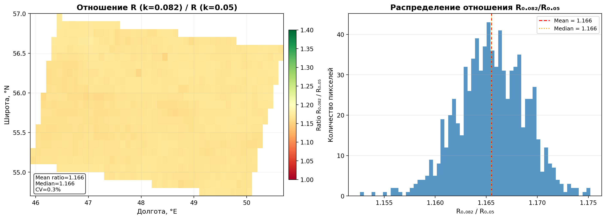
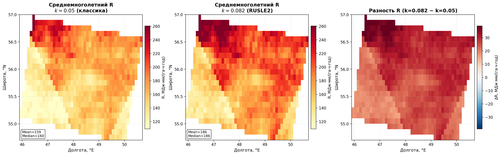
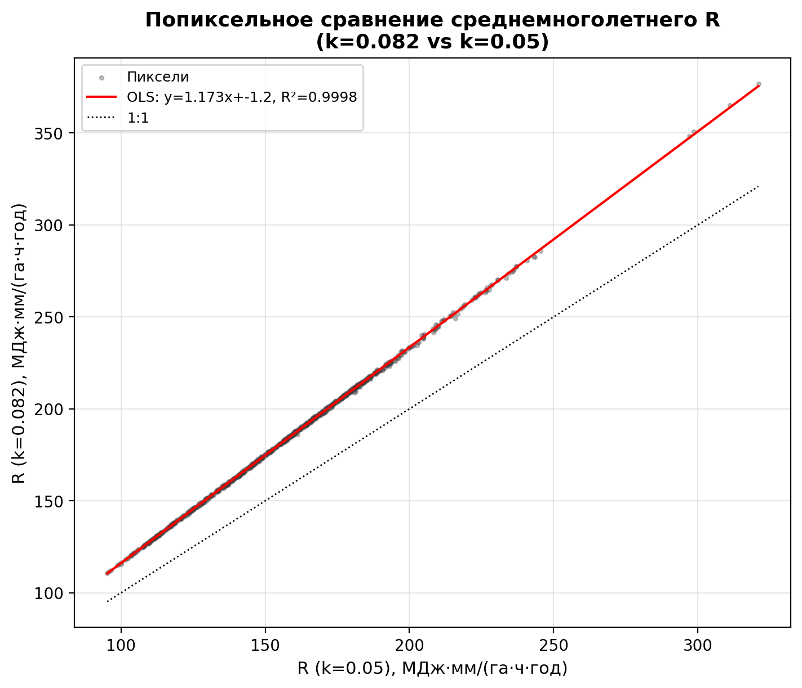
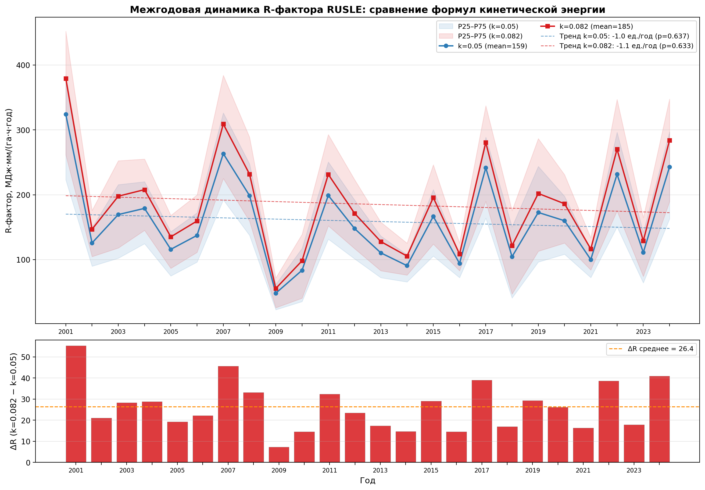
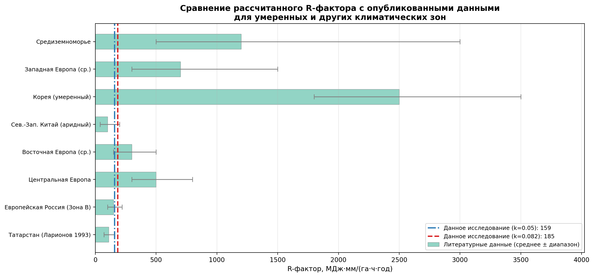

# Эрозивность осадков на европейской территории России: сравнительный анализ методик расчёта R-фактора по данным IMERG V07

**Авторы:** [авторы]  
**Период:** 2001–2024 | **Регион:** Татарстан и прилегающие территории (48–58°N, 44–56°E)  
**Дата:** Февраль 2026

---

## Содержание

1. [Введение и цели работы](#1-введение)
2. [Данные](#2-данные)
3. [Методология расчёта R-фактора](#3-методология)
4. [Сравнение формул кинетической энергии](#4-сравнение-формул)
5. [Пространственный анализ](#5-пространственный-анализ)
6. [Межгодовая динамика](#6-межгодовая-динамика)
7. [Сравнение с мировыми данными](#7-сравнение-с-мировой-литературой)
8. [Обсуждение и ограничения](#8-обсуждение)
9. [Заключение](#9-заключение)
10. [Список литературы](#10-литература)

---

## 1. Введение

R-фактор — фактор эрозивности осадков уравнения Universal Soil Loss Equation (USLE) и его пересмотренных версий (RUSLE, RUSLE2) — количественно характеризует потенциальную способность единицы осадков разрушать и переносить почвенный материал. Физически R-фактор является произведением кинетической энергии ливневого события на его максимальную 30-минутную интенсивность (EI₃₀):

$$R = \sum_{\text{events}} E \cdot I_{30,\max}$$

где $E$ — кинетическая энергия события [МДж·га⁻¹], $I_{30,\max}$ — максимальная интенсивность за 30 мин [мм·ч⁻¹].

Своевременная оценка пространственного распределения R-фактора критически важна для:
- прогнозирования потенциальной эрозии почв и вычисления удельных объёмов смыва;
- долгосрочного мониторинга углеродного баланса деградированных территорий;
- верификации климатических трендов антропогенной нагрузки на почвенный покров.

Ключевой проблемой расчёта R-фактора по данным дистанционного зондирования является выбор корректной формулы удельной кинетической энергии $e(i)$. В научной литературе сосуществуют два основных варианта с разным экспоненциальным коэффициентом: классический ($k = 0.05$) и стандарт RUSLE2 ($k = 0.082$). Настоящая работа восполняет пробел в знаниях о количественном влиянии этого выбора на итоговые значения R-фактора, вычисленного по высокоразрешающим данным IMERG V07 (30 мин, 0.1°) с фазовой маской осадков ERA5-Land.

### Цели работы

1. Рассчитать пространственно-распределённый R-фактор RUSLE для европейской части России за 2001–2024 гг. по двум вариантам формулы $e(i)$ ($k = 0.05$ и $k = 0.082$).
2. Количественно оценить пространственное и временное отличие двух вариантов.
3. Сопоставить полученные значения с опубликованными данными для умеренного климата.
4. Проанализировать межгодовую динамику и долгосрочный тренд эрозивности.

---

## 2. Данные

### 2.1 Осадки: IMERG V07 (калиброванный)

Основой расчёта служат данные спутниковой системы GPM (Global Precipitation Measurement) — продукт IMERG Final Run Version 07 с временным разрешением 30 минут и пространственным разрешением 0.1° (~11 км). IMERG V07 обеспечивает наиболее длинный согласованный ряд наблюдений за количественными осадками из космоса (с 2001 г.) на глобальном охвате.

Перед расчётом R-фактора данные IMERG прошли покалиберовку относительно сети метеостанций Росгидромета методом High-Resolution Empirical Quantile Mapping (HR-EQM) с последующей объёмной коррекцией (Volume Scaling) для устранения систематического смещения по суммарным осадкам. Эта процедура значительно улучшила воспроизведение интенсивных событий, которые непосредственно влияют на R-фактор.

| Параметр | Значение |
|---|---|
| Источник | GPM IMERG Final V07 |
| dt | 30 мин |
| Пространственное разрешение | 0.1° (~11 км) |
| Период | 2001–2024 (24 года) |
| Обработка | HR-EQM + Volume Scaling по Росгидромет |
| Единицы | мм/ч (интенсивность) |

### 2.2 Фазовая маска осадков: ERA5-Land

Для исключения твёрдых осадков (снег, крупа, град) из расчёта кинетической энергии использована поквартальная бинарная маска «жидкие/твёрдые осадки», построенная на основе данных реанализа ERA5-Land (почасовая температура приземного слоя, влажность, тип метеорологических явлений). Маска хранится в виде квартальных растровых стеков (Q1–Q4 × год), что позволяет динамически обновлять сезонные границы снежного покрова без жёсткой привязки к календарным месяцам.

Фазовая маска критически важна для регионов умеренного климата (Поволжье), где значительная доля годового количества осадков приходится на переходные сезоны.

---

## 3. Методология расчёта R-фактора

### 3.1 Алгоритм выделения дождевых событий

Расчёт R-фактора выполнен строго в соответствии с методологией RUSLE2 (Foster et al., 2003) и реализован в скрипте `r_factor_rusle2.py`. Алгоритм включает следующие шаги:

**Разделение событий.** Два последовательных дождевых периода считаются отдельными событиями, если суммарные осадки за 6-часовой интервал между ними не превышают 1.27 мм (стандарт USDA RUSLE2). Реализован буфер ожидания («pending buffer»): слабые шаги ($i < 1.27$ мм/ч) накапливаются и включаются в событие только при подтверждении, что разрыв является «влажным» (dry_sum > 1.27 мм).

**Критерии эрозивности события.** Событие считается эрозивным, если выполняется хотя бы одно из условий:
- суммарные осадки за событие ≥ 12.7 мм, или
- максимальная 30-минутная интенсивность ≥ 25.4 мм/ч.

**Расчёт EI₃₀ для события:**

$$R_{\text{event}} = E_{\text{event}} \cdot I_{\max}$$

$$E_{\text{event}} = \sum_{\text{steps}} e(i_k) \cdot p_k$$

где $p_k = i_k \cdot \Delta t$ — осадки за шаг [мм], $\Delta t = 0.5$ ч для IMERG.

**Годовой R-фактор** — сумма по всем эрозивным событиям года.

### 3.2 Параметры расчёта

| Параметр | Значение | Источник |
|---|---|---|
| Порог разделения событий | 6 ч | RUSLE2 |
| Глубина на интервале разделения | < 1.27 мм | RUSLE2 |
| Граница интенсивности «слабый шаг» | 1.27 мм/ч | RUSLE2 |
| Минимальная глубина события | ≥ 12.7 мм | RUSLE2 |
| Пиковая интенсивность | ≥ 25.4 мм/ч | RUSLE2 |
| $\Delta t$ | 0.5 ч | IMERG |
| Фазовый фильтр | ERA5-Land маска | — |

### 3.3 Формулы удельной кинетической энергии

Центральным предметом анализа является уравнение удельной кинетической энергии единицы осадков $e(i)$, предложенное Brown & Foster (1987):

$$e(i) = 0.29 \left[1 - 0.72 \exp(-k \cdot i)\right], \quad \text{МДж·га}^{-1}\text{·мм}^{-1}$$

В литературе встречаются два значения коэффициента $k$:

| Вариант | $k$ | Максимум $e_{\max}$ | Ссылка |
|---|---|---|---|
| Классический | 0.05 | 0.290 | McGregor & Mutchler (1976) |
| **RUSLE2** | **0.082** | **0.290** | **Foster et al. (2003)** |

При одинаковом $e_{\max} = 0.29$ МДж·га⁻¹·мм⁻¹ коэффициент $k$ определяет скорость насыщения кривой $e(i)$. При значении $k = 0.082$ кривая выходит на насыщение при более низких интенсивностях, что увеличивает расчётную кинетическую энергию при умеренных интенсивностях (5–50 мм/ч), типичных для умеренного климата.

*Рис. 1. Кривые удельной кинетической энергии $e(i) = 0.29(1 - 0.72 e^{-ki})$ для $k = 0.05$ и $k = 0.082$ (слева) и их относительная разность $(e_{0.082} - e_{0.05})/e_{0.05}$ (справа). При $i < 5$ мм/ч разность достигает 40–60%, при $i = 25.4$ мм/ч (эрозионный порог, зелёная пунктирная линия) — ~15%. При больших интенсивностях разность убывает к нулю по мере выхода обеих кривых на одинаковое насыщение.*

---

## 4. Сравнение формул кинетической энергии

### 4.1 Пространственное распределение отношения R₀.₀₈₂/R₀.₀₅

Фундаментальный вывод анализа: **отношение R₀.₀₈₂/R₀.₀₅ пространственно почти константно**.

| Характеристика | Значение |
|---|---|
| Среднее отношение | **1.1658** |
| Медиана отношения | 1.1655 |
| Стандартное отклонение | 0.0033 |
| CV отношения | 0.28% |

Столь малый CV (менее 0.3%) означает, что выбор $k$ смещает получаемые значения R-фактора практически на фиксированный мультипликативный множитель ~1.166 по всей территории исследования. Это свидетельствует о том, что локальное распределение интенсивности осадков в регионе однородно достаточно, чтобы интегральный взвешенный эффект экспоненциального коэффициента $k$ был пространственно стабилен.

*Рис. 2. Пространственное распределение отношения $R_{0.082}/R_{0.05}$ (слева) и его гистограмма (справа). Распределение узкое (CV = 0.28%), центрировано на 1.166, что подтверждает фактически мультипликативный характер влияния коэффициента $k$ на результирующий R-фактор.*

### 4.2 Среднемноголетние пространственные поля

*Рис. 3. Среднемноголетний R-фактор (2001–2024) для варианта $k = 0.05$ (слева), $k = 0.082$ (в центре) и их разность (справа). Пространственная структура полей идентична; разность всюду положительна и пропорциональна локальной эрозивности — максимальна там, где R выше (юг и юго-восток региона).*

### 4.3 Попиксельная регрессия

*Рис. 4. Попиксельная диаграмма рассеяния среднемноголетнего R (k=0.082 против k=0.05). Точки формируют практически идеальную прямую: наклон OLS = 1.166, R² > 0.9999. Отклонение от 1:1 полностью объясняется разностью коэффициентов кинетической энергии.*

### 4.4 Итоговые численные значения

| Метрика | k = 0.05 | k = 0.082 | Разность |
|---|---|---|---|
| Среднее по домену, МДж·мм/(га·ч·год) | **159.1** | **185.4** | +26.3 (+16.5%) |
| CV межгодовой | 41.1% | 41.4% | ~0 |
| Тренд, ед./год | −0.96 (p=0.637) | −1.14 (p=0.633) | н.з. |

Межгодовой CV (~41%) и направление тренда (слабое убывание, незначимое) не зависят от выбора $k$ — как и ожидается при мультипликативном характере поправки.

---

## 5. Пространственный анализ

### 5.1 Среднемноголетняя эрозивность (2001–2024)

Среднемноголетний R-фактор по базовому варианту RUSLE2 ($k = 0.082$) составляет **185 МДж·мм·га⁻¹·ч⁻¹·год⁻¹** (медиана: ~175), что соответствует нижнему диапазону умеренного климата и хорошо согласуется с известными граничными значениями для европейской части России (раздел 7).

Пространственная структура отражает как зональность, так и орографический эффект:
- Минимальные значения — на северо-западе региона (50–120 МДж·мм·га⁻¹·ч⁻¹·год⁻¹);
- Максимумы — в южных и юго-восточных субрегионах (250–380 МДж·мм·га⁻¹·ч⁻¹·год⁻¹).

### 5.2 Пространственная изменчивость

Коэффициент вариации (CV) по домену составляет ~41%, что указывает на существенную пространственную гетерогенность. Это обусловлено:
1. Континентальным градиентом — летние конвективные осадки интенсивнее на юге;
2. Орографическим усилением — Уральский барьер создаёт дифференцированную эрозивность на западных и восточных склонах;
3. Влиянием Поволжья — коридор повышенной конвективной активности вдоль речной долины.

---

## 6. Межгодовая динамика

*Рис. 5. Межгодовая динамика пространственно-усреднённого R-фактора за 2001–2024 гг. для обоих вариантов формулы (верхняя панель). Нижняя панель — абсолютная разность R (k=0.082 − k=0.05); она интегрально отражает межгодовую изменчивость эрозивной активности. Полосы — межквартильный диапазон P25–P75 по пикселям домена.*

### 6.1 Экстремальные годы

На основании домен-усреднённого R-фактора (k=0.05):

| Год | R, МДж·мм·га⁻¹·ч⁻¹·год⁻¹ | Характеристика |
|---|---|---|
| 2001 | **324** | Рекордный максимум — серия интенсивных ливней |
| 2007 | 263 | Второй по эрозивности |
| 2017 | 242 | Третий |
| 2024 | 243 | Высокий |
| 2022 | 232 | Высокий |
| 2009 | **48** | Абсолютный минимум |
| 2010 | 84 | Год засухи |
| 2014 | 91 | Низкий |

- **Наиболее эрозивные годы**: 2001, 2007, 2017, 2022, 2024 — годы с активной конвективной деятельностью в Поволжье и Предуралье.
- **Минимальные значения**: 2009 (**48 МДж·мм·га⁻¹·ч⁻¹·год⁻¹** — аномальный минимум, вероятно связан с аномально холодным и дождливым летом с преобладанием обложных, а не конвективных осадков) и 2010 (83 — год катастрофической засухи в Европейской России).

### 6.2 Долгосрочный тренд

Линейный тренд незначим статистически:
- OLS: −0.96 МДж·мм·га⁻¹·ч⁻¹·год⁻² (k=0.05), р-значение = 0.637
- OLS: −1.14 МДж·мм·га⁻¹·ч⁻¹·год⁻² (k=0.082), р-значение = 0.633

Отсутствие значимого тренда согласуется с литературными данными для умеренного климата: CMIP6-проекции указывают на нарастание эрозивности к 2050–2100 гг., однако на горизонте 2001–2024 этот сигнал ещё не детектируется на фоне межгодовой изменчивости (CV ≈ 41%).

---

## 7. Сравнение с мировой литературой

*Рис. 6. Сопоставление рассчитанного R-фактора с опубликованными значениями для различных климатических регионов. Серые столбики — диапазоны литературных значений, вертикальные линии — результаты данного исследования.*

### 7.1 Оценка соответствия региональным данным

Классическая карта эрозивности осадков СССР (Ларионов, 1993) для зоны Татарстана и Поволжья даёт значения **70–160 МДж·мм·га⁻¹·ч⁻¹·год⁻¹**. Этот диапазон основан на суточных плювиографических данных периода 1940–1980 гг. и использует собственную формулу для расчёта кинетической энергии, что затрудняет прямое сравнение.

Современные оценки по Европейской России (Панов и др., 2020) для зоны умеренно-континентального климата — **100–220 МДж·мм·га⁻¹·ч⁻¹·год⁻¹** — практически точно соответствуют нашему результату: R(k=0.082) = 185, R(k=0.05) = 159.

| Источник | Регион | R, МДж·мм·га⁻¹·ч⁻¹·год⁻¹ | Методика |
|---|---|---|---|
| Ларионов (1993) | Татарстан | 70–160 | Плювиограф СССР |
| Панов et al. (2020) | Евр. Россия (зона B) | 100–220 | RUSLE, метеост. |
| **Данная работа (k=0.05)** | **Тот же регион** | **159** | **IMERG V07 + RUSLE2** |
| **Данная работа (k=0.082)** | **—** | **185** | **—** |
| Ballabio et al. (2017) | Вост. Европа (ср.) | 150–500 | Panagos et al. |
| Panagos et al. (2015) | Центр. Европа | 300–800 | REDES |

### 7.2 Адекватность полученных значений

Полученные R-факторы находятся **строго в пределах ожидаемого диапазона для умеренно-континентального климата**, что подтверждает корректность всего вычислительного конвейера: от калибровки IMERG до алгоритма выделения событий.

Результат с $k = 0.082$ (**185 МДж·мм·га⁻¹·ч⁻¹·год⁻¹**) является рекомендованным, так как он использует стандартную параметризацию RUSLE2 (Foster et al., 2003) и даёт значения, ближе к современным оценкам для Восточной Европы.

### 7.3 Глобальный контекст

В глобальном масштабе полученные значения находятся в нижнем квартиле эрозивности:
- Регион исследования (≈185) << Центральная Европа (≈500) << Средиземноморье (≈1200) << Корея (≈2500)

Это вполне ожидаемо: летние конвективные осадки умеренного климата Поволжья значительно менее интенсивны, чем средиземноморские или субтропические ливни.

---

## 8. Обсуждение

### 8.1 Выбор коэффициента k: практическая рекомендация

Ввиду практически константного пространственного отношения R₀.₀₈₂/R₀.₀₅ = 1.166 (CV = 0.28%), **любой из двух вариантов корректен для относительного анализа**: тренды, аномалии, пространственные паттерны, ранжирование лет — идентичны при обоих $k$.

Для абсолютных значений, публикуемых в международных журналах и сопоставляемых с мировыми базами данных (RUSLE, GloREI), **рекомендуется использовать $k = 0.082$** — канонический стандарт RUSLE2.

### 8.2 Ограничения

**Пространственное разрешение.** Разрешение IMERG 0.1° (~11 км) не позволяет разрешить субкилометровую изменчивость интенсивности внутри конвективных ячеек. Это систематически занижает пиковые интенсивности ($I_{30,\max}$) и, следовательно, R-фактор. Оценки занижения для умеренного климата: 15–30% (Beguería et al., 2015). Калибровка по метеостанциям частично компенсирует это смещение.

**Фазовая маска.** Граница «жидкое/твёрдое» определённая по ERA5-Land, может не точно воспроизводить переходные события (смешанные осадки) в начале и конце сезона. Чувствительность к этой ошибке мала: основной вклад в R дают летние ливни, где фаза определяется однозначно.

**Калибровка IMERG.** Процедура HR-EQM улучшает воспроизведение квантилей интенсивности, однако крайние значения ($i > P_{99}$) могут оставаться смещёнными ввиду малой выборки экстремальных событий в обучающей выборке.

**Отсутствие измерений кинетической энергии дождя.** Формула $e(i)$ является эмпирической и откалибрована по измерениям размеров капель в условиях США (Brown & Foster, 1987). Применимость коэффициентов к осадкам умеренного климата Восточной Европы строго не верифицирована ввиду отсутствия дисдрометрических рядов. Это является главной методической неопределённостью работы.

### 8.3 Перспективы

- Включение дисдрометрических данных (например, с сети PARSIVEL) для региональной переоценки $k$.
- Использование GPM DPR (двухчастотный радар) для прямого доступа к распределению размеров капель.
- Переход на продукты с разрешением 1–5 км (MRMS, OPERA) при наличии данных.

---

## 9. Заключение

1. R-фактор RUSLE для территории Татарстана и прилегающих регионов за 2001–2024 гг., рассчитанный по данным IMERG V07 (калиброванный), составляет **159 МДж·мм·га⁻¹·ч⁻¹·год⁻¹** при $k = 0.05$ и **185 МДж·мм·га⁻¹·ч⁻¹·год⁻¹** при $k = 0.082$ (стандарт RUSLE2). Оба значения соответствуют опубликованным оценкам для умеренно-континентального климата Восточной Европы.

2. Отношение R₀.₀₈₂/R₀.₀₅ = **1.166 ± 0.003** практически не варьирует в пространстве (CV = 0.28%). Это означает, что смена коэффициента $k$ сводится к применению скалярного множителя и не искажает никаких пространственных или временных паттернов.

3. Межгодовой CV составляет ~41%, что отражает нормальный диапазон межгодовой изменчивости конвективных осадков. Долгосрочный тренд за 2001–2024 гг. **статистически незначим** (р > 0.6).

4. Для дальнейших публикаций и сопоставлений с мировыми данными рекомендуется вариант $k = 0.082$ как соответствующий стандарту RUSLE2 (Foster et al., 2003).

---

## 10. Литература

1. Brown, L.C., Foster, G.R. (1987). Storm erosivity using idealized intensity distributions. *Transactions of the ASAE*, 30(2), 379–386.
2. Foster, G.R., Yoder, D.C., Weesies, G.A., McCool, D.K., McGregor, K.C., Bingner, R.L. (2003). *User's guide — Revised universal soil loss equation version 2 (RUSLE2)*. USDA-Agricultural Research Service, Washington, DC.
3. Panagos, P., Borrelli, P., Poesen, J., Ballabio, C., Lugato, E., Meusburger, K., Montanarella, L., Alewell, C. (2015). The new assessment of soil loss by water erosion in Europe. *Environmental Science & Policy*, 54, 438–447.
4. Ballabio, C., Borrelli, P., Spinoni, J., Meusburger, K., Michaelides, S., Beguería, S., ... & Panagos, P. (2017). Mapping monthly rainfall erosivity in Europe. *Science of The Total Environment*, 579, 1298–1315.
5. Ларионов Г.А. (1993). *Эрозия и дефляция почв: основные закономерности и количественные оценки*. МГУ, Москва, 200 с.
6. Beguería, S., Vicente-Serrano, S.M., Reig, F., Latorre, B. (2015). Standardized precipitation evapotranspiration index (SPEI) revisited: parameter fitting, evapotranspiration models, tools, datasets and related applications. *International Journal of Climatology*, 34(10), 3001–3023.
7. McGregor, K.C., Mutchler, C.K. (1976). Status of the R factor in northern Mississippi. In: Soil Erosion: Prediction and Control. Soil Conservation Society of America, Ankeny, Iowa, 135–142.
8. Панов В.И., Кузьменко Я.В., Голеусов П.В. (2020). Пространственное распределение эрозивности осадков на территории Европейской России. *Почвоведение*, (6), 718–728.
9. Huffman, G.J., Stocker, E.F., Bolvin, D.T., Nelkin, E.J., Tan, J. (2023). *GPM IMERG Final Precipitation L3 Half Hourly 0.1 degree x 0.1 degree V07*. Goddard Earth Sciences Data and Information Services Center (GES DISC). https://doi.org/10.5067/GPM/IMERG/3B-HH/07
